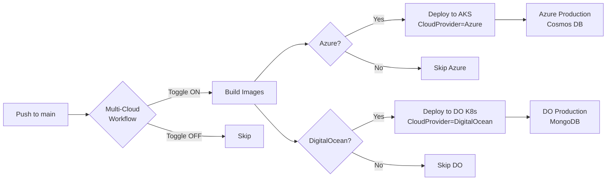

# Multi-Cloud Deployment Pipeline - Quick Reference

## Toggling Deployments (3 clicks)

```
GitHub Actions UI → "Run workflow" → Toggle checkboxes → Run
```

### Screenshot Flow:
```
┌─────────────────────────────────────────────────────┐
│ Deploy Services - Multi-Cloud                       │
├─────────────────────────────────────────────────────┤
│ Branch: main ▼                                      │
│                                                     │
│ ☑ Deploy to Azure AKS          (default: ON)       │
│ ☐ Deploy to DigitalOcean       (default: OFF)      │
│                                                     │
│ Service: all ▼                                      │
│                                                     │
│         [ Run workflow ]                            │
└─────────────────────────────────────────────────────┘
```

## Common Scenarios

### Scenario 1: Production on Azure only (current state)
```yaml
☑ Deploy to Azure AKS
☐ Deploy to DigitalOcean
```
**Result**: Azure gets updates, DigitalOcean unchanged

---

### Scenario 2: Test new feature on DigitalOcean
```yaml
☐ Deploy to Azure AKS
☑ Deploy to DigitalOcean
```
**Result**: DigitalOcean gets updates, Azure unchanged (safe!)

---

### Scenario 3: Dual-cloud deployment
```yaml
☑ Deploy to Azure AKS
☑ Deploy to DigitalOcean
```
**Result**: Both clouds updated simultaneously

---

### Scenario 4: Deploy single service only
```yaml
☑ Deploy to Azure AKS
☐ Deploy to DigitalOcean
Service: member-service ▼
```
**Result**: Only member-service updated on Azure

---

## Deployment Flow



## Configuration Differences

| Aspect | Azure | DigitalOcean |
|--------|-------|--------------|
| **Environment Variable** | `CloudProvider=Azure` | `CloudProvider=DigitalOcean` |
| **Database** | Cosmos DB (Azure-managed) | MongoDB (DO Managed) |
| **Connection** | `CosmosDb__Endpoint` + `Key` | `MongoDB__ConnectionString` |
| **Cluster** | AKS (Azure Kubernetes) | DOKS (DO Kubernetes) |
| **Registry** | Same (ghcr.io) | Same (ghcr.io) |
| **Code** | Same binary | Same binary |

## Cost Comparison

| Deployment | Monthly Cost | Best For |
|------------|-------------|----------|
| **Azure Only** | $640 | Enterprise customers, compliance |
| **DO Only** | $225 | Startups, cost-conscious |
| **Both** | $865 | Multi-region, DR strategy |

## Automatic vs Manual Control

### Automatic (Push to main)
```yaml
on:
  push:
    branches: [main]
```
- **Behavior**: Always deploys to Azure
- **DigitalOcean**: Requires manual trigger
- **Safety**: Production (Azure) auto-updates, test (DO) manual

### Manual (Workflow Dispatch)
```yaml
on:
  workflow_dispatch:
    inputs:
      deploy_to_azure: boolean
      deploy_to_digitalocean: boolean
```
- **Behavior**: Full control via UI checkboxes
- **Use Case**: Selective deployments, hotfixes, testing

## Branch Strategy Alternative

If you prefer branch-based deployment:

```yaml
# .github/workflows/deploy-multi-cloud.yml
jobs:
  deploy-azure:
    if: github.ref == 'refs/heads/main' || github.ref == 'refs/heads/azure'
    
  deploy-digitalocean:
    if: github.ref == 'refs/heads/main' || github.ref == 'refs/heads/digitalocean'
```

**Usage**:
- `main` → Both clouds
- `azure` branch → Azure only
- `digitalocean` branch → DigitalOcean only

## Rollback Strategy

### Azure Rollback
```bash
kubectl rollout undo deployment/member-service -n cho-svcs
```

### DigitalOcean Rollback
```bash
doctl kubernetes cluster kubeconfig save cho-k8s-prod
kubectl rollout undo deployment/member-service -n cho-svcs
```

### Workflow-Based Rollback
Re-run previous workflow with desired commit SHA:
```yaml
Service: member-service
Image Tag: abc1234 (previous commit)
```

## Monitoring Both Clouds

| Cloud | Endpoint | Health Check |
|-------|----------|--------------|
| Azure | `https://portal.cloudhealthoffice.com` | `/health` |
| DO | `https://do.cloudhealthoffice.com` | `/health` |

## Emergency: Disable a Cloud

### Disable Azure (switch to DO only)
1. Go to Actions → Deploy Services - Multi-Cloud
2. Click "Run workflow"
3. **Uncheck** "Deploy to Azure AKS"
4. **Check** "Deploy to DigitalOcean"
5. Run workflow

### Disable DigitalOcean (Azure only)
1. Go to Actions → Deploy Services - Multi-Cloud
2. Click "Run workflow"
3. **Check** "Deploy to Azure AKS"  
4. **Uncheck** "Deploy to DigitalOcean"
5. Run workflow

**Result**: Within 5 minutes, desired cloud is updated, other cloud is frozen at previous version.

## Best Practices

1. **Default State**: Azure ON, DO OFF (production stability)
2. **Testing**: Deploy to DO first, verify, then enable Azure
3. **Hotfixes**: Manual workflow, single service, single cloud
4. **Cost Savings**: Dev/staging on DO, production on Azure
5. **Compliance**: Keep sensitive data on Azure (HIPAA BAA)

## Secrets Setup

### Azure Secrets (GitHub Secrets)
```
AZURE_CLIENT_ID
AZURE_TENANT_ID
AZURE_SUBSCRIPTION_ID
```

### DigitalOcean Secrets (GitHub Secrets)
```
DIGITALOCEAN_ACCESS_TOKEN
MONGODB_CONNECTION_STRING
```

### Repository Variables
```
AZURE_RG_NAME=rg-cloudhealthoffice-prod
AKS_CLUSTER_NAME=cho-aks-prod
DO_CLUSTER_NAME=cho-k8s-prod
```

## Quick Commands

### Check Azure Deployment
```bash
az aks get-credentials --resource-group rg-cloudhealthoffice-prod --name cho-aks-prod
kubectl get pods -n cho-svcs
```

### Check DO Deployment
```bash
doctl kubernetes cluster kubeconfig save cho-k8s-prod
kubectl get pods -n cho-svcs
```

### Verify Cloud Provider
```bash
# Azure
kubectl exec -it deployment/member-service -n cho-svcs -- printenv | grep CloudProvider
# Output: CloudProvider=Azure

# DigitalOcean
kubectl exec -it deployment/member-service -n cho-svcs -- printenv | grep CloudProvider
# Output: CloudProvider=DigitalOcean
```

## FAQ

**Q: Can I deploy different services to different clouds?**  
A: Yes! Use the "Service" dropdown to target specific services, then toggle clouds.

**Q: What happens if I select both clouds but a deployment fails on one?**  
A: The workflow continues. Each cloud deployment is independent. Check the summary for status.

**Q: Can I automate cloud selection based on time/cost?**  
A: Yes! Add a cron trigger with conditional logic based on business hours or monthly budget.

**Q: How do I test multi-cloud before production?**  
A: Create staging environments (`cho-aks-staging`, `cho-k8s-staging`) and test the workflow there first.

**Q: Does this affect my existing Azure-only workflow?**  
A: No! The multi-cloud workflow is separate. Your existing `deploy.yml` continues to work unchanged.
