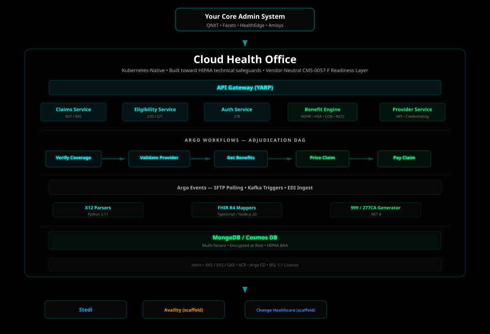
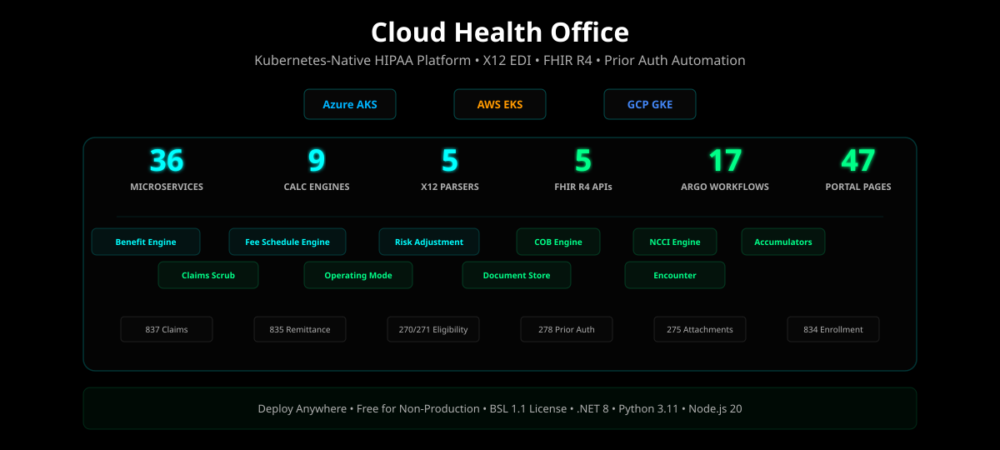
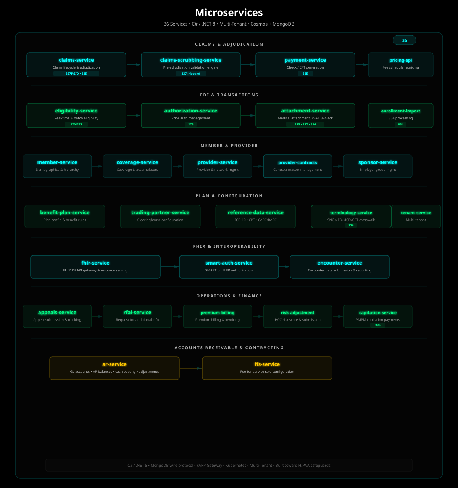
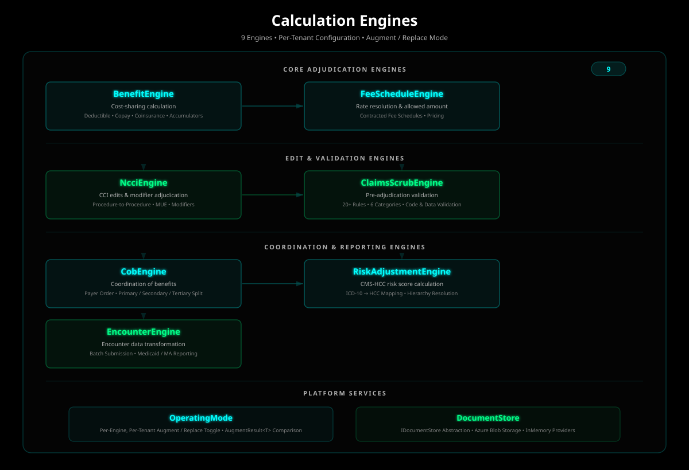
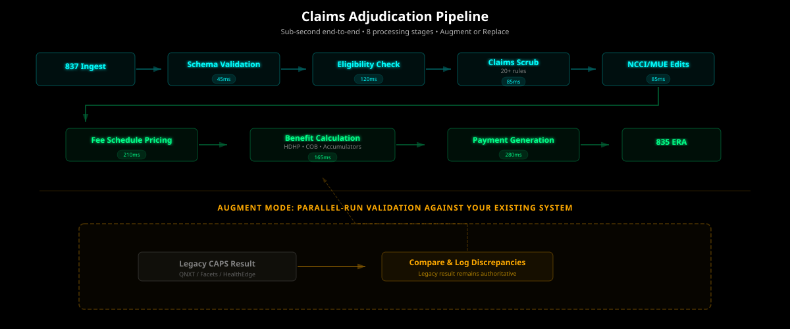
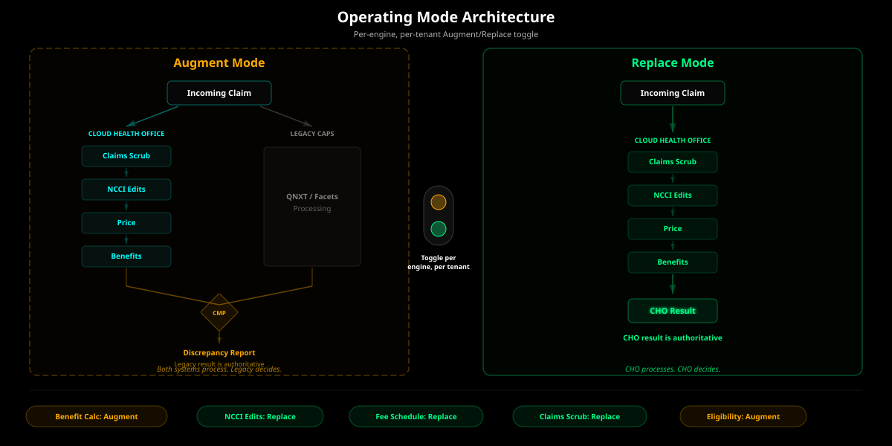

# Cloud Health Office


**A cloud-native portfolio for healthcare claims administration — from free public tools to full payer-scale platform engagement.**

CMS-0057-F compliance, real-time EDI, FHIR R4 APIs, and claims adjudication engines.
Deploy alongside your existing Core Admin Processing System (CAPS) today. Migrate workloads on your timeline.

[](./CHANGELOG.md)
[](./tests/) <!-- auto-updated by test-metrics workflow -->
[](./tests/)
[](./SECURITY.md)
[

</div>

-----

## Why This Exists

Health plans face a January 2027 CMS-0057-F compliance deadline. The typical path — upgrade your core admin system — costs $1.5M–3M, takes 12–18 months, and disrupts live operations.

Cloud Health Office is a different approach. It deploys alongside your existing core admin system and handles the workloads that legacy platforms weren’t built for: real-time EDI routing, FHIR R4 APIs, prior authorization automation, and medical attachment workflows. Every module is designed to either augment or replace the corresponding function in your core system — you decide which workloads to migrate and when.

Start with compliance. Expand into claims. Move at your own pace.

## Product Lines

Cloud Health Office is a portfolio of four complementary product lines —
each a coherent offering on its own, each connecting naturally to the next:

- **Public Tools** — free utilities (fee schedule lookup, free-tier claims
  repricing) that establish credibility and seed the commercial funnel.
- **Transactional Services** — per-call APIs (Claims Repricing API, Pricing
  API) on self-serve subscription. Developer- and integrator-accessible.
- **Managed Data Services** — subscription services for healthcare data that
  changes constantly: state Medicaid compliance updates, CMS fee schedule
  updates, provider verification, terminology mapping.
- **Platform Engagement** — payer-scale relationships priced per member per
  month (PMPM), across three layers: Compliance Accelerator, Progressive
  Modernization, and Full CAPS Platform.

Customers enter at any product line and expand over time. See
[docs/POSITIONING.md](docs/POSITIONING.md) for the canonical framing.

## How It Works



## Platform



|Component           |Count    |Details                                                                                                    |
|---------------------|---------|-----------------------------------------------------------------------------------------------------------|
|Microservices        |36       |C# / .NET 8, multi-tenant, Cosmos + MongoDB dual-repo                                                      |
|Adjudication Engines |9        |Benefit, Fee Schedule, NCCI, COB, Risk Adj, Encounter, Claims Scrub, Prior Auth Rule, Provider Verification|
|Supporting Projects  |4        |Operating Mode, Document Store, Provider Enrollment, enrollment-wiring                                     |
|X12 Parsers          |5        |275, 276, 277, 278 (Python), 834 (Node.js)                                                                 |
|FHIR APIs            |5        |Patient Access, Provider Access, Payer-to-Payer, Prior Auth, Provider Directory                            |
|Argo Workflows       |17       |Claims adjudication, EDI ingest, enrollment import, RFAI                                                    |
|Portal Pages         |97       |Blazor Server + MudBlazor, Microsoft Entra ID (multi-tenant)                                                |
|CI/CD Workflows      |18       |GitHub Actions — build, test, deploy, security scan                                                         |
|Claims Scrubbing     |20+ rules|Data completeness, ICD-10/CPT format, NPI Luhn, POS, filing limits                                         |
|Automated Tests      |5214     |C# xUnit, TypeScript Jest, Python pytest                                                                    |
|Test Projects        |44       |Repositories and suites covered by automated test execution                                                |

### Services



|Service                  |Purpose                                      |X12 Transactions|
|-------------------------|---------------------------------------------|----------------|
|claims-service           |Claim lifecycle and adjudication; in-process structural scrubbing via ClaimsScrubEngine |837P/I/D, 835   |
|eligibility-service      |Real-time and batch eligibility              |270/271         |
|authorization-service    |Prior auth management                        |278             |
|attachment-service       |Medical attachment correlation, RFAI, 824 ack|275, 277, 824   |
|enrollment-import-service|834 enrollment processing                    |834             |
|benefit-plan-service     |Plan configuration and benefit rules         |—               |
|coverage-service         |Member coverage and accumulators             |—               |
|member-service           |Demographics and subscriber hierarchy        |—               |
|sponsor-service          |Employer group management                    |—               |
|provider-service         |Provider and network management              |—               |
|payment-service          |Check/EFT generation                         |835             |
|appeals-service          |Appeal submission and tracking               |—               |
|trading-partner-service  |Clearinghouse configuration                  |—               |
|tenant-service           |Multi-tenant provisioning                    |—               |
|rfai-service             |Request for additional information workflows |—               |
|reference-data-service   |ICD-10, CPT, CARC/RARC code sets             |—               |
|encounter-service        |Encounter data submission and reporting       |—               |
|fhir-service             |FHIR R4 API gateway and resource serving      |—               |
|premium-billing-service  |Premium billing and invoicing                 |—               |
|capitation-service       |PMPM capitation payments to providers         |835             |
|risk-adjustment-service  |HCC risk score calculation and submission     |—               |
|smart-auth-service       |SMART on FHIR authorization                   |—               |
|pricing-api              |Medicare/custom fee schedule repricing       |—               |
|ar-service               |GL accounts, AR balances, cash posting, adjustments|—          |
|terminology-service      |SNOMED↔ICD-10/CPT/HCPCS terminology crosswalk (FHIR $translate)|278  |
|provider-contracts-service|Provider contract master management          |—               |
|provider-verification-service|Multi-source provider verification & integrity scoring|—         |
|ffs-service              |Fee-for-service rate configuration            |—               |

### Adjudication Engines



|Engine                    |Purpose                                                                                                     |
|--------------------------|------------------------------------------------------------------------------------------------------------|
|BenefitEngine             |Cost-sharing calculation (deductible, copay, coinsurance), accumulator tracking, service category resolution|
|FeeScheduleEngine         |Rate resolution against contracted fee schedules, allowed amount calculation                                |
|NcciEngine                |CCI procedure-to-procedure edits, medically unlikely edits (MUE), modifier adjudication                     |
|CobEngine                 |Coordination of benefits, payer order determination, primary/secondary/tertiary payment split               |
|RiskAdjustmentEngine      |ICD-10 to HCC mapping, hierarchy resolution, CMS-HCC risk score calculation                                 |
|EncounterEngine           |Encounter data transformation and batch submission for Medicaid/MA reporting                                |
|ClaimsScrubEngine         |Pre-adjudication validation: 20+ rules across 6 categories (data completeness, code validation, date logic, amount logic, provider validation, modifier validation)|
|PriorAuthRuleEngine       |CRD → DTR → PAS prior-authorization rule evaluation and decision orchestration                              |
|ProviderVerificationEngine|Multi-source provider verification: NPPES, OIG/LEIE, PECOS, Open Payments, Medicare Utilization, FSMB. Composite 0–100 integrity scoring with configurable dimension weights|

### Supporting Projects

Additional projects under `src/engines/` that are not adjudication engines:

|Project                 |Purpose                                                                                                     |
|------------------------|------------------------------------------------------------------------------------------------------------|
|OperatingMode           |Per-engine, per-tenant Augment/Replace mode toggle with AugmentResult&lt;T&gt; for parallel-run comparison against legacy CAPS|
|DocumentStore           |IDocumentStore abstraction with Azure Blob Storage + InMemory providers for attachment and document management|
|ProviderEnrollmentService|Provider enrollment workflow coordination                                                                  |
|cho-enrollment-wiring   |Enrollment import orchestration wiring for 834 EDI processing                                               |

### Provider Verification

The Provider Verification Service aggregates six federal and licensed data sources to produce a composite integrity score for every provider in your network. The score is cached on the `Provider` and `ProviderContract` entities for sub-millisecond claims adjudication gating.

|Data Source         |Purpose                                                                                                     |
|--------------------|------------------------------------------------------------------------------------------------------------|
|NPPES Registry      |NPI validation, provider demographics, taxonomy codes, practice addresses, enumeration status               |
|OIG/LEIE            |Federal exclusion screening — providers barred from Medicare/Medicaid participation                          |
|PECOS               |Medicare FFS enrollment status, provider type, specialty, reassignment relationships                        |
|CMS Open Payments   |Industry payments to providers — conflict of interest screening                                              |
|Medicare Utilization|Service volumes, top HCPCS codes, Part D prescribing patterns                                               |
|FSMB (Premium)      |State license verification, disciplinary actions, DEA registration, board certifications                    |

The composite score uses five weighted dimensions (NPI 30%, Exclusion 30%, Medicare 15%, License 15%, COI 10%) and maps to a rating: **Clear** (80–100), **Advisory** (60–79), **Caution** (40–59), **Alert** (20–39), or **Blocked** (0–19). Excluded providers trigger an immediate hard stop (score = 0, Blocked) regardless of other dimensions.

API endpoints: `GET /api/v1/providers/{npi}/verify`, `GET /api/v1/providers/{npi}/nppes`, `GET /api/v1/providers/{npi}/integrity-score`, `GET /api/v1/providers/search/nppes`, `POST /api/v1/providers/verify/batch`. Full documentation at [docs/provider-verification-guide](https://cloudhealthoffice.com/docs/provider-verification-guide).

### Claims Adjudication Pipeline



The adjudication pipeline processes each claim through eight stages with sub-second end-to-end latency. In Augment mode, the pipeline runs in parallel with your legacy CAPS and logs discrepancies without affecting production claims processing.

### CMS-0057-F Compliance


Cloud Health Office implements the CMS Interoperability and Prior Authorization Final Rule ahead of the January 2027 deadline.

|Requirement            |Implementation                                         |
|-----------------------|-------------------------------------------------------|
|Patient Access API     |FHIR R4 — Claim, EOB, Coverage, Patient, Encounter     |
|Provider Access API    |FHIR R4 — Claim, EOB, Patient, Condition, Observation  |
|Payer-to-Payer API     |FHIR R4 — bidirectional member data exchange           |
|Prior Authorization API|FHIR R4 + CDS Hooks — real-time PA decisions           |
|Provider Directory API |FHIR R4 — Practitioner, Organization, Location, Network|
|USCDI v1/v2            |US Core profiles, Da Vinci Implementation Guides       |

### Augment / Replace Architecture



Every CHO engine can run in one of two modes, configured per-tenant:

**Augment:** CHO processes claims alongside your existing CAPS. Both systems compute results independently. CHO logs discrepancies but your legacy system remains authoritative. This is how every deployment starts.

**Replace:** CHO is the authoritative system for that engine. Your legacy system is no longer used for that function.

Toggle engines independently — run benefit calculation in Augment while NCCI edits run in Replace. Migrate at your own pace, one engine at a time.

### Operations Portal

Cloud Health Office includes a full operations portal built with Blazor Server and MudBlazor, secured by Microsoft Entra ID with multi-tenant authentication. The portal is organized into six functional areas:

**Operations:** Dashboard with KPI cards (total claims, approval rate, processing time, plan paid), claims-by-status donut chart, recent claims and authorizations tables, operational alerts (work queue counts, pending RFAIs, appeals due this week), EDI transaction volume, and system health indicators. Claims management with advanced search. Claims work queues organized by pend reason (NCCI failures, missing auth, provider not contracted, COB required, medical review) with examiner assignment and priority tracking. Eligibility verification (270/271), prior authorization management (278), and appeals tracking with regulatory deadline monitoring (30-day standard, 72-hour expedited for Medicare Advantage).

**Members & Providers:** Search-first member lookup enforcing HIPAA minimum necessary — no data displayed until explicit search. Member detail with demographics, coverage history, PCP assignment, 834 enrollment transactions, and plan year accumulator display showing deductible and OOP max progress bars. Provider directory with credentialing status, network participation, contract details, and performance metrics. Enrollment operations dashboard for daily 834 file processing.

**Configuration:** Benefit plan management (HMO, PPO, HDHP, Medicaid MCO) with service category cost-sharing rules. Sponsor/employer group management. Trading partner configuration. Reference data (ICD-10, CPT, HCPCS, Revenue, POS codes).

**Finance:** Payment run management with 835 ERA generation and batch processing status. Premium billing with billing cycle management, sponsor invoicing, mid-month proration, aging reports, and delinquency tracking. Capitation management with provider contract administration (age-sex rate tiers, risk adjustment, quality withholds, stop-loss), monthly capitation run execution, statement review with member-level PMPM breakdowns, approve/hold/void workflows, and batch disbursement via NACHA ACH credits or Stripe Connect.

**Monitoring:** Workflow monitor with real-time SignalR updates from Argo Workflows, claims adjudication pipeline timeline with per-step latency, and failed workflow retry. EDI operations center. Reports.

**Admin:** Settings with Operating Mode configuration display. Correspondence center with adverse determination letters, RFAI tracking, EOB statements, and provider payment notices.

## Typical Adoption Path

Most health plans follow a phased approach:

**Phase 1 — Compliance (weeks):** Deploy FHIR R4 APIs alongside your existing CAPS to satisfy CMS-0057-F. All CHO engines run in **Augment mode** — computing results in parallel with your legacy system, logging discrepancies, but leaving your core system authoritative. Your operations team uses the portal to monitor processing and verify results match.

**Phase 2 — Validation (months):** Expand EDI routing through CHO for multi-clearinghouse failover, real-time 276/277 status, and 275/RFAI workflows. As confidence builds, toggle individual engines from Augment to **Replace mode** — starting with NCCI edits and claims scrubbing (lowest risk), then fee schedule pricing, then benefit calculation. Each engine can be toggled independently per tenant.

**Phase 3 — Full Operations (your timeline):** With engines validated and operations staff trained on the portal, migrate remaining workloads. The portal provides the full operational workflow: claims processing, work queues, member services, prior authorization, appeals, enrollment, premium billing, and provider management. Your legacy CAPS becomes optional.

## Quick Start

**Prerequisites:** Docker, .NET 8 SDK

```bash
# Clone
git clone https://github.com/aurelianware/cloudhealthoffice.git
cd cloudhealthoffice

# Build and run the core adjudication services (mongo + redis + claims + benefit-plan + ...)
docker compose --profile core up -d

# Verify
curl http://localhost:5001/health/live
```

`docker compose up -d` with no `--profile` only starts infra (Mongo + Redis) — see the port map and profile list at the top of [docker-compose.yml](docker-compose.yml). Use `--profile finance` or `--profile fhir` (or combine flags) to bring up additional service groups.

### Full Development Stack

To bring up the complete backend (all 36 services + MongoDB + Redis + seed data):

```bash
# Start everything
docker compose -f docker-compose.development.yml up -d

# Wait for health checks to pass
docker compose -f docker-compose.development.yml ps

# Verify seed data loaded
docker compose -f docker-compose.development.yml exec mongodb \
  mongosh cloudhealthoffice --eval 'db.Claims.countDocuments()'
```

Services are available at `http://localhost:5001` through `5012` (Swagger UI at `/swagger` on each). See [docker-compose.development.yml](docker-compose.development.yml) for the full port map and configuration. Copy `.env.example` to `.env` to customise credentials.

Or deploy to Azure:

[](https://portal.azure.com/#create/Microsoft.Template/uri/https%3A%2F%2Fraw.githubusercontent.com%2Faurelianware%2Fcloudhealthoffice%2Fmain%2Finfrastructure%2Fazure%2Fazure%2Fazuredeploy.json)

## Project Structure

```
cloudhealthoffice/
├── src/
│   ├── services/           # 36 C# microservices
│   ├── engines/            # 9 adjudication engines + supporting projects
│   ├── portal/             # Blazor Server portal (50 pages, MudBlazor, Entra ID multi-tenant)
│   ├── site/               # Marketing site (cloudhealthoffice.com)
│   ├── fhir/               # FHIR R4 APIs and X12→FHIR mappers
│   ├── api-docs/           # Swagger UI (api.cloudhealthoffice.com)
│   ├── ai/                 # AI-assisted EDI resolution
│   └── tools/              # Migration wizard
├── infrastructure/
│   ├── argo-workflows/     # 17 workflow DAGs
│   ├── argo-events/        # SFTP, Kafka, EDI event sources
│   ├── azure/              # Bicep IaC
│   ├── helm/               # Helm chart
│   ├── k8s/                # Kubernetes manifests
│   └── monitoring/         # Grafana + Prometheus
├── containers/             # Sidecar containers (parsers, encoders, SFTP)
├── schemas/                # X12 XSD schemas, JSON schemas (auth, appeals)
├── tests/                  # Unit, integration, E2E, fixtures
├── docs/                   # Architecture, ADRs, guides, features
├── scripts/                # Deploy, setup, CLI tools
├── config/                 # Configuration schemas and examples
├── core/                   # Shared types and validation
└── api/                    # OpenAPI specs and quickstarts
```

## Tech Stack

**Backend:** C# / .NET 8, Python 3.11, Node.js 20
**Frontend:** Blazor Server, MudBlazor, Microsoft Entra ID (multi-tenant)
**Data:** MongoDB / Azure Cosmos DB (dual-repository pattern)
**Orchestration:** Argo Workflows + Argo Events (Kubernetes-native)
**Infrastructure:** Azure (AKS, ACR, Key Vault, Cosmos DB), Helm, Bicep IaC
**EDI:** X12 5010 (270/271, 275, 276/277, 278, 834, 835, 837, 824, 999)
**FHIR:** R4, US Core 3.1.1+, Da Vinci IG (PDex, PAS, CRD, DTR, HRex), SMART on FHIR, content negotiation
**CI/CD:** GitHub Actions (18 workflows), Codecov, Dependabot, Gitleaks

### Codebase Scale

|Category         |Lines    |Breakdown                                                       |
|-----------------|---------|----------------------------------------------------------------|
|Application Code |300,000  |C# 86.8K, TypeScript 24.4K, Razor 19.8K, Python 6.7K, JS 2.6K |
|Web / UI         |9,500    |HTML/CSHTML 6.2K, CSS 3.4K                                     |
|Infrastructure   |55,000   |YAML 27.2K, JSON 15.4K, Shell 8.3K, PowerShell 3.2K, Docker 1.3K|
|Documentation    |150,000  |Architecture, ADRs, deployment guides, features, security, sales|
|**Total**        |**~500,000+**|                                                             |

~5,214 automated tests across 44 test projects in C# (xUnit), TypeScript (Jest), and Python (pytest).
Built by a solo founder with 25+ years of payer IT experience and AI-assisted development.

## Deployment Options

|Option                      |Best For                               |Time to Production|
|----------------------------|---------------------------------------|------------------|
|**Kubernetes (AKS/EKS/GKE)**|Enterprise control, multi-cloud, hybrid|1–2 hours         |
|**Docker Compose**          |Development, evaluation, POC           |5 minutes         |

## Documentation

|Document                                                                          |Description                                   |
|----------------------------------------------------------------------------------|----------------------------------------------|
|[Quickstart](docs/guides/QUICKSTART.md)                                           |Get running in 5 minutes                      |
|[Architecture](docs/architecture/ARCHITECTURE.md)                                  |System design and service interactions        |
|[Deployment Guide](docs/guides/DEPLOYMENT.md)                                     |Production deployment for Azure and Kubernetes|
|[CMS-0057-F Compliance](docs/features/CMS-0057-F-COMPLIANCE.md)                   |Regulatory compliance mapping                 |
|[Claims Pipeline](docs/features/837-CLAIMS-PIPELINE.md)                           |End-to-end claims adjudication flow           |
|[Attachment Architecture](docs/features/AUTHORIZATION-ATTACHMENTS-ARCHITECTURE.md)|275/277/RFAI/824 attachment workflows         |
|[EDI Workflows](docs/features/EDI-WORKFLOWS-COMPLETE.md)                          |All X12 transaction processing flows          |
|[ADR Index](docs/adr/)                                                            |Architecture Decision Records                 |
|[Provider Verification](docs/provider-verification/ARCHITECTURE.md)               |Multi-source verification architecture        |

## Who This Is For

**Medicaid MCOs** facing CMS-0057-F deadlines without the budget or runway for a core system upgrade. **Medicare Advantage plans** exiting BPaaS arrangements and building internal operations capability. **Commercial payers** modernizing EDI infrastructure and adding FHIR APIs. **Health plan startups** that need a production-grade payer platform from day one.

## Channel Partners

Cloud Health Office is designed for channel distribution through implementation partners who have existing health plan client relationships.

**For implementation firms:** CHO gives you a platform to sell alongside your consulting services. The subscription revenue goes to Aurelianware; the implementation services revenue — benefit plan configuration, provider network setup, EDI trading partner onboarding, parallel-run validation, engine-by-engine cutover — goes to you.

**For health plans:** Your existing implementation partner deploys CHO alongside your current CAPS in 90 days. They configure it using the same domain expertise they've always applied to your system. You get CMS-0057-F compliance without disrupting operations.

Contact [partners@cloudhealthoffice.com](mailto:partners@cloudhealthoffice.com) to discuss channel partnership opportunities.

## Pricing

Commercial licensing available upon request. Contact our team for production licensing.

No transaction caps. No feature gates. No per-claim charges. Every tier includes the full platform.

Contact [sales@cloudhealthoffice.com](mailto:sales@cloudhealthoffice.com) for pricing details.

## Licensing

Cloud Health Office is a **source-available** platform licensed under the [Business Source License 1.1](./LICENSE). It is **not** open source software.

- **Non-production use is free.** You may use Cloud Health Office at no cost for evaluation, development, testing, staging, and proof-of-concept work.
- **A paid commercial license is required for production use.** Any deployment serving live members, processing real claims, or generating revenue requires a subscription from Aurelianware, Inc.

|                          |                                                              |
|--------------------------|--------------------------------------------------------------|
|**License**               |Business Source License 1.1 (BSL 1.1)                        |
|**Free for**              |Non-production use — evaluation, development, testing, staging|
|**Requires a license for**|Production deployment                                         |
|**Converts to**           |Apache 2.0 on 2030-03-08                                      |
|**Licensor**              |Aurelianware, Inc                                             |

For full license terms, see [LICENSE](./LICENSE). For a plain-language overview, see [LICENSE_SUMMARY.md](./LICENSE_SUMMARY.md).

For commercial licensing: [sales@cloudhealthoffice.com](mailto:sales@cloudhealthoffice.com)

## Links

- **Website:** [cloudhealthoffice.com](https://cloudhealthoffice.com)
- **Portal:** [portal.cloudhealthoffice.com](https://portal.cloudhealthoffice.com)
- **GitHub:** [github.com/aurelianware/cloudhealthoffice](https://github.com/aurelianware/cloudhealthoffice)
- **Sales:** [sales@cloudhealthoffice.com](mailto:sales@cloudhealthoffice.com)
- **Enterprise:** [enterprise@cloudhealthoffice.com](mailto:enterprise@cloudhealthoffice.com)

-----

<div align="center">

Built by [Aurelianware, Inc.](https://cloudhealthoffice.com) · 25+ years of payer platform experience

</div>
