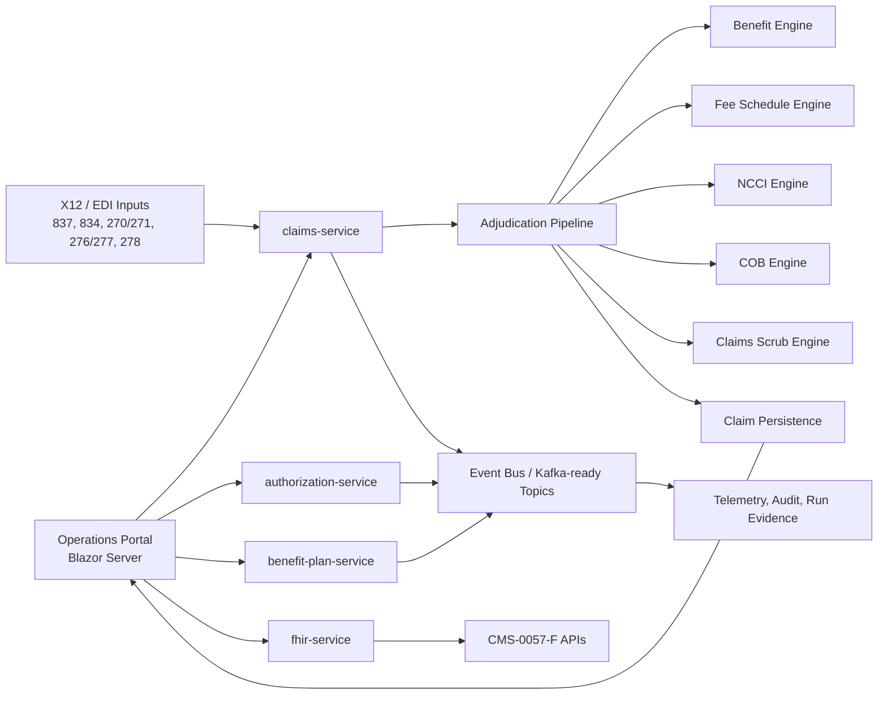

# CloudHealthOffice


[](LICENSE)
[](https://dotnet.microsoft.com/)
[](docs/deployment/DEPLOYMENT.md)
[](docs/features/FHIR-INTEGRATION.md)
[](docs/compliance/CMS-0057-F-READINESS-MATRIX.md)

CloudHealthOffice is a source-available, Kubernetes-first healthcare payer
administration platform. It is built for teams modernizing claims, benefits,
eligibility, prior authorization, FHIR interoperability, and X12 operations
without treating a legacy Core Administration Processing System as the only
place business logic can live.

The project is licensed under BSL 1.1. Non-production use is permitted for
evaluation, development, testing, and staging. See [LICENSE](LICENSE) for the
exact terms.

## Executive Summary

Health plans need modern APIs, event-driven operations, auditable adjudication,
and CMS-0057-F interoperability. Legacy CAPS platforms such as Facets, QNXT, and
HealthEdge remain operationally important, but they were not designed around
Kubernetes, FHIR R4, X12 event streams, or continuous benchmark evidence.

CloudHealthOffice is designed as a cloud-native payer platform that can be
deployed alongside existing systems, used to validate specific workloads, and
progressively expanded. Current evidence is strongest around local Kubernetes
claims adjudication, workflow scoring, pended-claim observability, and operator
console inspection through the Million Claim Challenge.

## Who It Is For

- Health plan engineering teams evaluating CAPS modernization paths.
- Payer platform architects working with claims, benefits, eligibility, and
  prior authorization systems.
- Healthcare interoperability teams implementing CMS-0057-F, FHIR R4, and X12.
- Contributors who want to work on production-oriented healthcare platform
  infrastructure.

## What Makes It Different

- **Kubernetes-first:** services, jobs, workflows, and local benchmark runs are
  designed around containerized operation.
- **Evidence-first:** the Million Claim Challenge publishes reproducible command
  lines, run summaries, validation outcomes, and raw artifacts instead of only
  marketing claims.
- **API-first:** payer operations are exposed through service APIs, a Blazor
  portal, and FHIR/X12 integration surfaces.
- **Event-oriented:** claims and operational workflows are structured for
  asynchronous processing, durable audit trails, and future streaming analytics.
- **Truthful scoring:** paid, denied, pended, mismatched, unsupported, platform
  failures, false pends, and payment deltas are separated.

## Key Features

| Area | Current focus |
| --- | --- |
| Claims adjudication | Professional, institutional, and dental synthetic claims; workflow scoring; claim detail views; mass adjudication console |
| Benefit administration | Declarative benefit models, cost sharing, accumulators, service-category mapping, and plan versioning |
| Pricing and edits | Fee schedules, NCCI/MUE checks, claims scrubbing, COB, provider network checks, and prior-auth rules |
| Interoperability | FHIR R4 projections, X12 parsing/processing, terminology lookup, and CMS-0057-F readiness docs |
| Operations portal | Claims search, claim detail, mass adjudication runs, EDI transaction history (834/837), dashboards, work queues, and administrative surfaces |
| Deployment | Docker Compose, Kubernetes manifests, GitHub Actions, and deployment documentation |
| Benchmarks | 5K, 10K, 50K, 100K, and full 1,000,000-claim Million Claim Challenge evidence packets |

## Platform Architecture



Start with [docs/architecture/README.md](docs/architecture/README.md) for the
architecture map and component-level guides.

## Screenshots And Evidence

The current public evidence comes from local Docker Desktop Kubernetes runs and
the Mass Adjudication console.

| View | Screenshot |
| --- | --- |
| 100K run dashboard | [episode-008-100k-dashboard.png](docs/million-claim-challenge/podcast/episode-008/screenshots/episode-008-100k-dashboard.png) |
| Outcome breakdown | [episode-008-100k-outcome-breakdown.png](docs/million-claim-challenge/podcast/episode-008/screenshots/episode-008-100k-outcome-breakdown.png) |
| Claim detail summary | [episode-008-claim-detail-summary.png](docs/million-claim-challenge/podcast/episode-008/screenshots/episode-008-claim-detail-summary.png) |
| Live telemetry | [episode-007-live-telemetry-running.png](docs/million-claim-challenge/podcast/episode-007/screenshots/episode-007-live-telemetry-running.png) |

Screenshot placeholder structure for future documentation lives in
[docs/assets/screenshots/README.md](docs/assets/screenshots/README.md).

## Million Claim Challenge

The Million Claim Challenge is the project’s benchmark and proof ladder. It is
not just a load test. It validates whether the platform reaches the right
disposition, preserves pended-claim observability, separates unsupported gaps,
and reports payment accuracy independently from workflow correctness.

Current published local evidence includes:

- Full 1,000,000-claim corpus run (episode 15) with zero platform failures,
  129,981/130,000 workflow checks matched, zero unsupported scenarios, and a
  payment-amount gate of 20,000/20,000 exact within one cent.
- 100,000-claim local Kubernetes run with zero platform failures, zero scoreable
  workflow mismatches, zero unexpected pends across scoreable non-pend claims,
  and 2,000 of 2,000 comparable payments within one cent.
- Operator-console evidence for completed run summaries, claim-level drilldown,
  unsupported filters, payment evidence, and lifecycle timing.

Start here:

- [Benchmark documentation](docs/benchmarks/README.md)
- [Episode 008 100K result](docs/million-claim-challenge/podcast/episode-008/article.txt)
- [100K benchmark results](docs/million-claim-challenge/podcast/episode-008/benchmark-results.txt)

## CMS-0057-F

CloudHealthOffice includes documentation and implementation surfaces for the CMS
Interoperability and Prior Authorization Final Rule. Treat the readiness matrix
as the source of truth for current status and gaps.

- [CMS-0057-F readiness matrix](docs/compliance/CMS-0057-F-READINESS-MATRIX.md)
- [CMS-0057-F compliance guide](docs/features/CMS-0057-F-COMPLIANCE.md)
- [FHIR integration](docs/features/FHIR-INTEGRATION.md)
- [Prior authorization API](docs/features/PRIOR-AUTHORIZATION-API.md)

## Quick Start

For the shortest path, use the current quickstart:

```bash
git clone https://github.com/aurelianware/cloudhealthoffice.git
cd cloudhealthoffice

docker compose --profile core up -d
curl http://localhost:5001/health/live
```

Then continue with:

- [Quickstart guide](docs/guides/QUICKSTART.md)
- [Kubernetes deployment](docs/deployment/DEPLOYMENT.md)
- [Developer guide](docs/developer/README.md)
- [Testing guide](tests/README.md)

## Repository Layout

```text
src/
  services/        Microservices: claims, benefits, auth, FHIR, terminology, payment, etc.
  engines/         Benefit, fee schedule, NCCI, COB, scrub, risk, encounter, prior-auth engines
  portal/          Blazor Server operations portal
  site/            Marketing and documentation website
  fhir/            FHIR resources, projections, and conformance work
docs/
  architecture/    Platform architecture and component guides
  benchmarks/      Million Claim Challenge methodology and reproducibility
  compliance/      CMS-0057-F and regulatory readiness
  deployment/      Local, Docker, Kubernetes, and cloud deployment
  domain/          Healthcare payer domain primers
  developer/       Contributor and engineering onboarding
tests/             Unit, integration, and service-level test projects
```

## Documentation Index

- [Documentation home](docs/README.md)
- [Architecture](docs/architecture/README.md)
- [Healthcare domain](docs/domain/README.md)
- [Benchmarks](docs/benchmarks/README.md)
- [Developer guide](docs/developer/README.md)
- [Deployment](docs/deployment/DEPLOYMENT.md)
- [Roadmap](docs/roadmap/README.md)
- [Architecture decisions](ARCHITECTURE_DECISIONS.md)

## Contributing

CloudHealthOffice needs contributors who care about healthcare correctness,
operability, reproducibility, and privacy. Good first contributions include
documentation improvements, benchmark reproducibility notes, test coverage,
developer-experience fixes, and clearly scoped service bugs.

- [Contributing guide](CONTRIBUTING.md)
- [Good first issues guide](GOOD_FIRST_ISSUES.md)
- [Code of conduct](CODE_OF_CONDUCT.md)
- [Security policy](SECURITY.md)
- [Support](SUPPORT.md)

Never include PHI, production credentials, real patient data, real member data,
or real claim data in issues, discussions, examples, logs, screenshots, tests, or
pull requests.

## Community

- Ask questions in [GitHub Discussions](https://github.com/aurelianware/cloudhealthoffice/discussions).
- Report bugs with the GitHub issue templates.
- Report security vulnerabilities privately; see [SECURITY.md](SECURITY.md).
- Propose roadmap or architecture changes through an issue or ADR.

## Roadmap

The public roadmap is maintained in [docs/roadmap/README.md](docs/roadmap/README.md)
and separates implemented functionality, current work, next steps, future work,
and stretch goals. Planned capabilities are intentionally labeled as planned.

## Status Notes

CloudHealthOffice is an active platform repository, not a packaged production
appliance. Some services are more mature than others. Current benchmark evidence
is local Kubernetes evidence, not a production cloud capacity claim. The docs
favor reproducibility and explicit gaps over inflated completeness claims.
