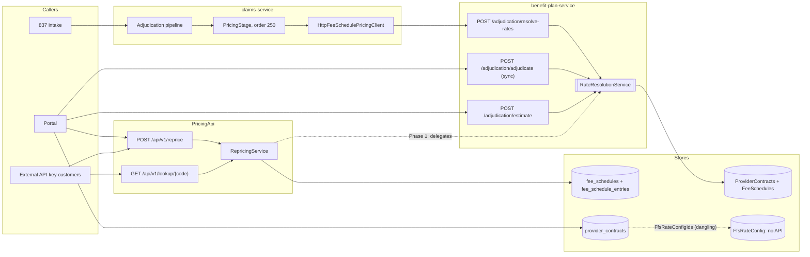

# ADR 016: One Contract Model Feeding One Pricing Engine

## Status

Accepted. Phase 1 (one engine) is implemented. The engine's facility rule now
follows the CMS site-of-service list (section 5; the facility rule risk is fixed).
Phases 2 to 5 (one contract model) are planned for later PRs.

## Context

A claim's allowed amount should not depend on which door it came in by. Today
it does. Cloud Health Office has two contract schemas in two document stores,
a fee-for-service rate config with no API, and two pricing engines that
disagree.

### What each store holds

| Store | Schema | Written by | Read by |
| --- | --- | --- | --- |
| `provider_contracts` (Mongo, provider-contracts-service) | `ProviderContractsService.Models.ProviderContract`: the legal agreement. Contract number, NPI, TIN (sensitive), provider type, line of business, `PlanIds[]`, `PaymentMethodology` (FFS / capitation / hybrid / global risk), network participation, signatory, effective and termination dates, auto-renewal, amendments, lifecycle status, and the ids of `CapitationRateConfig` and `FfsRateConfig` children. **No rates.** | Portal *Provider Contracts* page through the provider-contracts-service REST API | Portal only. Nothing that prices a claim reads it. |
| `FfsRateConfig` (ffs-service) | Child of a provider contract: `ContractId`, `FeeScheduleId`, `FeeSchedulePercentage` (multiplier, default 1.0), `MultipleProcedureReduction` and `BilateralAdjustment` toggles, effective dates, status. | Nothing. ffs-service has a model and a `Program.cs` with auth wiring, but **no controller and no repository**. | Nothing. |
| `ProviderContracts` + `FeeSchedules` (Mongo or Cosmos, FeeScheduleEngine) | `FeeScheduleEngine.Models.ProviderContract`: NPI or group TIN, one `PlanId`, network status, a default `FeeScheduleId`, and `ContractLines[]` that route procedure-code ranges to other schedules. `FeeSchedule`: type (MPFS, OPPS, Medicaid, commercial, custom, per diem, DRG, capitation), GPCI and conversion factor, percent-of-Medicare and its base schedule, per diem and DRG base rates, provenance and licensing, and `Lines[]` (procedure or revenue code, modifier, rate type, rate, RVUs, DRG weight, multiple procedure indicator, bilateral and assistant flags). | Seeding only (`BenchmarkClaimGenerator` `CosmosDbSeeder`). There is **no admin API**. | `RateResolutionService` in benefit-plan-service. |
| `fee_schedules` + `fee_schedule_entries` (Mongo `cho_pricing`, PricingApi) | `FeeScheduleInfo` (id, type: RBRVS / OPPS / DRG / Medicaid / commercial, version) and one `FeeScheduleEntry` per code and locality, holding **precomputed** facility and non-facility prices, RVUs, conversion factor, APC and status indicator, DRG weight and base rate, and the MPFS multiple procedure indicator. **No contracts.** | PricingApi admin upload and the CMS file loaders (`FeeScheduleLoaderService`) | PricingApi `RepricingService` |

So the legal contract (provider-contracts-service) and the contract that
pricing reads (FeeScheduleEngine) are two different documents with different
ids (`Guid` vs `{tenant}:{npi}:{plan}`), plan scoping (`PlanIds[]` vs one
`PlanId`) and network status enums. Neither one references the other.

### The two pricing engines (before this ADR)

| | `RateResolutionService` (FeeScheduleEngine) | `RepricingService` (PricingApi) |
| --- | --- | --- |
| Inputs | Provider, plan, service date, so the contract is looked up | A fee schedule id the caller names |
| Rate types | Flat, RVU × GPCI × CF, percent of billed, percent of Medicare (cross-schedule), Medicaid (three strategies), DRG (weight × base or case rate), per diem (line or all-inclusive), capitation | Stored facility / non-facility price, APC rate, DRG weight × base |
| Facility rule | Non-facility only for POS 11, 12, 02, 10 | Facility for a fixed list (21, 22, 23, 24, ...); everything else non-facility |
| Modifiers | 26/TC, 50, 22, 52/53, 62, 80, AS, 51, honouring the line's bilateral and assistant flags | 50, 52, 80, 81 (10%), 82, 62, 66 (25%), multiplied together |
| MPPR | Indicator 2 only, ranked by allowed amount after modifiers and units, 100/50/50, by-report flag from rank 6 | Indicator 2 or OPPS status T, ranked by base rate before modifiers and units |
| DRG on a multi-line claim | Case rate paid once, allocated across lines by billed charges; conflicting stay rates pend | Whole case rate on line 1, others $0 |
| Rounding | None on the allowed amount | Rounded to cents |
| Unpriceable lines | `BilledCharges` or `Unresolved`, so adjudication pends | `NotFound` at $0 |

The same claim against the same schedule could therefore price differently
in adjudication and in the repricing API: facility rates for POS 20, 49 or 81,
assistant-surgeon modifiers, MPPR ranking with units, and the DRG line split
all diverged.

### Call graph



Before Phase 1 the dotted `Repricing → RRS` edge did not exist:
`RepricingService` carried its own pricing logic.

## Decision

### 1. `RateResolutionService` is the only pricing engine

The FeeScheduleEngine's `RateResolutionService` survives. PricingApi's pricing
logic is removed. The reasons:

- **It already moves money.** Adjudication (async `PricingStage` through
  `resolve-rates`, the sync `adjudicate` endpoint and member estimates) prices
  with it. Changing the engine adjudication uses would be the riskier
  direction.
- **It is a superset.** It covers every rate type the PricingApi has, and adds
  contracts with code-range carve-outs, percent of Medicare, Medicaid
  cross-schedule pricing, per diem and revenue-code pricing.
- **It fails closed.** Unresolvable rates come back `Unresolved` with a reason,
  and conflicting per-stay rates pend. The PricingApi path silently returned
  $0.
- **It pays a stay once.** DRG and all-inclusive per diem amounts are
  allocated once per claim, which the 835 needs.
- **It is indicator-aware.** MPPR follows the MPFS multiple procedure
  indicator and flags indicators it does not implement, and every adjustment
  is recorded for CAS segments.
- **It is better tested.** It had 73 focused tests before this ADR. The
  PricingApi pricing logic had about 20.

PricingApi keeps what is genuinely its own: the public API and its response
contract, API keys, tiers and usage metering, code lookup, and the CMS file
loaders. Under Phase 4 the loaders become ingest into the canonical schedule
store.

### 2. The target contract model

There is one contract document. Its reimbursement terms are evaluated by one
engine, and the terms reference fee schedules whose lines are the existing
`FeeScheduleLine`.

```
Contract                                   (one per provider agreement; system of record)
├─ identity: tenantId, id, contractNumber
├─ provider: NPI, TIN (sensitive), group, providerType
├─ scope: lineOfBusiness, planIds[] (empty = all plans in the LOB), networkStatus
├─ effective / termination dates, status, amendments[], audit
└─ reimbursementTerms[]                    (ordered; first match wins; effective-dated)
   ├─ scope: procedure code ranges, revenue codes, place of service,
   │         claim type (professional / institutional IP / OP), service category
   ├─ method (exactly one):
   │   ├─ FeeScheduleRef     { feeScheduleId, multiplier = 1.0 }
   │   ├─ PercentOfMedicare  { baseScheduleId, percent }
   │   ├─ PercentOfBilled    { percent }
   │   ├─ CaseRate (DRG)     { drgScheduleId | baseRate + weights schedule }
   │   ├─ PerDiem            { rate | revenue-code schedule, allInclusive }
   │   └─ Capitation         { capitationRateConfigId }   (priced at $0 on the claim)
   ├─ carveOut: bool         (priced separately from, and in addition to, a per-stay rate)
   ├─ modifierRules: { multipleProcedureReduction, bilateral } (the FfsRateConfig toggles)
   ├─ lesserOfBilled: bool   (default false; contract-level default, term may override)
   ├─ stopLoss:  placeholder { thresholdBilled, percentAboveThreshold }   (not evaluated yet)
   └─ outlier:   placeholder { fixedLossThreshold, marginalCostFactor }   (not evaluated yet)

FeeSchedule → FeeScheduleLine[]            (unchanged engine model; global CMS schedules
                                            are IsGlobal with LicenseClassification)
```

Mapping from today's shapes:

| Today | Target |
| --- | --- |
| provider-contracts `ProviderContract` | `Contract` identity, provider and scope fields, verbatim |
| engine `ProviderContract.FeeScheduleId` | Last-resort term: `FeeScheduleRef`, no scope |
| engine `ProviderContractLine` (code range → schedule) | Scoped term: `FeeScheduleRef`, `carveOut` when the default is per-stay |
| engine `ProviderContract.LesserOfBilledCharges` (added in Phase 1) | Contract-level `lesserOfBilled` |
| `FfsRateConfig` | Term: `FeeScheduleRef { feeScheduleId, multiplier = FeeSchedulePercentage }` plus `modifierRules` |
| `CapitationRateConfig` | Term: `Capitation` |
| PricingApi `fee_schedule_entries` | Global `FeeSchedule` documents (flat lines with `FacilityRate`, or RVU lines) |

The engine resolves a claim line as contract, then the first matching term,
then a schedule line, a base amount, modifiers, units, MPPR, per-stay
allocation and finally lesser-of. The stop-loss and outlier placeholders are
stored but not evaluated. A term carrying them pends the claim until they are
implemented, rather than silently ignoring them.

### 3. Phase 1 (this PR): PricingApi delegates to the engine

- `RepricingService` translates the public request into engine
  `PricingRequest`s and calls `RateResolutionService.ResolveBatchAsync`, then
  maps the results back. The public request and response schema is unchanged.
- A schedule reaches the engine through `IPricingScheduleSource`.
  `LegacyEntryScheduleSource` (registered) adapts `fee_schedule_entries`:
  flat lines with a non-facility `Rate` and a `FacilityRate`, the MPFS
  indicator, OPPS status T mapped to indicator 2 (other statuses to 9), and DRG
  rows as base rate × weight. `EngineStoreScheduleSource` reads the canonical
  store. It is used by the parity tests and is ready for the dual-read phase.
- The contract a PricingApi caller implies is synthesized: every code is priced
  from the named schedule, with no carve-outs, no plan default and no
  lesser-of.
- One presentation rule stays. A line with no rate is `NotFound` at $0, where
  adjudication's engine result is `BilledCharges` (and the claim then pends).
- Engine changes needed for parity, all additive or improvements:
  - `FeeScheduleLine.FacilityRate`, a flat facility price chosen by place of
    service.
  - Allowed amounts rounded to cents in the engine.
  - Modifiers 81 and 82 paid at 16% (CMS assistant-surgeon rule).
  - `PricingResult.BaseAmount`, and a public `IsFacilityPlaceOfService` so
    callers display the engine's rule.
- **Lesser-of-billed**: `ProviderContract.LesserOfBilledCharges` (default
  `false`). Allowed = min(contract amount, billed), applied last, after
  modifiers, units and MPPR. A per-stay rate is compared once with the stay's
  total billed charges, never a line share with that line's charge. Lines
  priced at billed charges, unresolved lines and capitation are untouched. The
  result carries `LesserOfBilledApplied` and an audit adjustment.
- The parity tests (`UnifiedPricingParityTests`) run the same contract and
  claims through both entry points. They cover RBRVS (4 places of service),
  percent of Medicare, MPPR, DRG and per diem, both cross-store (legacy rows
  vs canonical) and same-store. They fail if the two diverge.

### 4. Migration plan (Phases 2 to 5)

**Phase 2: canonical schema, no behaviour change.**

- Add `ReimbursementTerms[]` and the contract identity fields to the engine's
  `ProviderContract` (additive; `[BsonIgnoreExtraElements]`).
- The engine evaluates terms when present, and otherwise uses
  `FeeScheduleId` + `ContractLines` exactly as today. Existing engine tests
  must pass unchanged, and new tests prove that a term-shaped contract and its
  legacy equivalent price identically.
- Give ffs-service its API, or fold it into provider-contracts-service: FFS
  terms become `reimbursementTerms` edited on the contract. Prefer the fold,
  because a rate config never exists without its contract.

**Phase 3: backfill.**

- One idempotent job per tenant builds a canonical contract for each
  `provider_contracts` document:
  - identity and scope come from the legal contract;
  - terms come from its `FfsRateConfig` and `CapitationRateConfig` children;
  - where an engine `ProviderContract` exists for the same NPI and plan, its
    `FeeScheduleId` and `ContractLines` become terms.
- Engine contracts with no legal contract (seeded data) become canonical
  contracts flagged `origin: engine-only` for review.
- Deterministic ids, so a re-run updates rather than duplicates.
- Each run produces a conflict report: the same NPI and plan with different
  schedules, plan-scope mismatches, and terms that reference missing
  schedules. Conflicts block the tenant's cutover until resolved.
- PricingApi `fee_schedule_entries` are re-ingested into global
  `FeeSchedule` documents through the loaders. The invariant is the
  cross-store parity test: for every code and place of service, the re-ingested
  schedule prices to the stored legacy price.

**Phase 4: dual read (shadow).**

- The engine's contract repository reads the canonical contract and the legacy
  contract, and prices with both. Both repositories are behind the existing
  `IProviderContractRepository` seam.
- It **pays on legacy** and emits a parity metric per line (match, amount
  delta, reason). PricingApi reads the canonical schedule store first and falls
  back to `fee_schedule_entries` (`EngineStoreScheduleSource`, then
  `LegacyEntryScheduleSource`).
- Writes go to the canonical contract only. The legacy engine contract is
  regenerated from it, so the two cannot drift during the window.
- Run it for at least one full monthly claim cycle per tenant. Exit criterion:
  zero unexplained deltas on adjudicated lines.

**Phase 5: cutover.**

- A per-tenant flag switches payment to the canonical result. Rollback is the
  same flag; legacy reads stay available for one more cycle.
- Then the legacy engine `ProviderContracts` collection becomes read-only and
  is archived, `fee_schedule_entries` is retired, and the dual-read code is
  removed.
- provider-contracts-service is the only contract writer. The engine owns only
  schedules and evaluation.

### 5. Facility rule follows CMS (fixed)

The engine's facility / non-facility rule used to be "facility everywhere except
POS 11, 12, 02 and 10". That paid urgent care (20), independent clinic (49),
independent lab (81) and most other settings at the facility rate, and telehealth
other than home (02) at the non-facility rate. It is now one shared definition,
`CloudHealthOffice.FeeScheduleEngine.Domain.FacilityPlaceOfService`, which
`RateResolutionService` (adjudication and benefit-plan-service `resolve-rates`)
and PricingApi `RepricingService` both use. No other copy exists: the
BenefitEngine and claims-service have no facility-rate POS list
(`ServiceCategoryResolver`'s POS table maps benefit categories, not rates).

- **Facility rate:** POS 02, 19, 21, 22, 23, 24, 26, 31, 34, 41, 42, 51, 52, 53,
  56, 61. Source: Medicare Claims Processing Manual, Pub. 100-04, Ch. 12,
  §20.4.2 "Site of Service Payment Differential" (Rev. 12823, effective
  2024-10-08), with code meanings from the CMS Place of Service Code Set.
- **Non-facility rate:** every other code, including 10, 11, 12, 20, 49, 50,
  81 and 99, and blank or unknown codes.
- **Telehealth.** From CY 2024, POS 02 is paid at the facility rate and POS 10
  at the non-facility rate (CY 2024 MPFS final rule, MLN MM13452). POS 10 was
  new in 2022, and Medicare telehealth in CY 2022 to 2023 was generally billed
  with the in-person POS and modifier 95, so the rule is not date-dependent.
- **Institutional lines.** An 837I line carries the facility type code (CLM05-1)
  in `PlaceOfServiceCode`, which is not a CMS POS. A request flagged
  `IsInstitutional` (callers set it from the claim type, so an 837I claim with
  no buildable type of bill still counts) or carrying a valid `BillType`
  (`NubcTypeOfBill`, the rule the benefit engine also uses) is always a facility
  setting and its facility type code is never read against the POS list. A
  malformed `BillType` on a professional claim is ignored. Estimates send the
  same claim type and bill type as adjudication, so both price alike. Before, facility types 11 and 12 (hospital inpatient) were read
  as POS 11 / 12 and took the non-facility rate; other facility types
  already took the facility rate.
- **Not modelled:** §20.4.2's code-level exceptions (professional component of
  diagnostic tests, outpatient therapy and CORF services always non-facility)
  are carried by the fee schedule's values, not by POS.
- A line with no facility rate (no `FacilityRate`, no `PeRvuFacility`) still
  prices at its single rate in every setting.
- **837I → facility rate is a parity rule, not full CMS policy.** Every entry
  point (claims-service `PricingStage`, `AdjudicationController`,
  `PaymentEstimateService`, and the Pricing API's `claimType` / `billType`)
  prices an institutional claim in the facility setting, so they agree with one
  another. Known CMS exceptions are **not yet modelled**: hospital outpatient
  therapy (TOB 13x with revenue codes 042x–044x) is paid at the MPFS
  **non-facility** rate, and critical access hospital Method II professional
  services (TOB 85x, revenue codes 096x–098x) are paid under the MPFS like a
  professional claim. Until they are, such lines take the facility rate.
- **DRG path (Pricing API).** An explicit `inpatient` claim is priced by its DRG.
  An `institutional` claim against an MS-DRG schedule is priced by DRG only with
  a hospital inpatient Part A type of bill (11x). TOB 12x (hospital inpatient
  Part B: benefits exhausted or not entitled to Part A) is paid outside the DRG
  and, like 13x outpatient, prices line by line.

## Consequences

### Positive

- One answer per claim: a repricing quote matches what adjudication pays for the
  same contract, and the parity tests keep it that way.
- PricingApi gains the engine's rate types and safety (percent of Medicare,
  per diem and fail-closed behaviour) as soon as it reads the canonical store.
- Engine fixes (facility list, new modifiers, stop-loss) land once.
- Lesser-of-billed is available per contract, off by default.

### Negative: PricingApi responses change for some claims (same request and response schema)

- **DRG on multi-line claims.** The case rate is now allocated across lines by
  billed charges, or evenly when no charges are sent. Before, the whole amount
  sat on line 1. The total is unchanged.
- **Facility rule.** Phase 1 made POS 20, 49, 50, 81 and others take the
  facility price (the engine's rule then), and POS 02 the non-facility price.
  Section 5 fixes this: only the CMS facility list (02, 19, 21 to 24, 26, 31,
  34, 41, 42, 51 to 53, 56, 61) takes the facility price, and every other POS,
  including 20, 49, 50, 81 and unknown codes, takes the non-facility price.
- **Modifiers.** 81 is now 16% (was 10%). 66 is now unadjusted with a
  "by report" warning (was 25%). 22, 53 and AS now adjust. 50 and the assistant
  modifiers honour the line flags.
- **MPPR.** Lines are ranked by allowed amount after modifiers and units, not
  by base rate. A single line carrying modifier 51 with indicator 2 is reduced
  50%.
- **Status reason.** `StatusReason` for allocated DRG lines now describes the
  allocation; it no longer says "Bundled under DRG payment".
- **Adjudication rounding.** Adjudication now rounds each line's allowed amount
  to cents inside the engine. This was already true in practice for MPFS and
  DRG amounts. Modifier-derived amounts could previously carry sub-cent
  fractions into benefits.

## Risks

| Risk | Mitigation |
| --- | --- |
| ~~The engine's facility rule is not the CMS rule. It treats POS 20, 49, 81 and others as facility settings and POS 02 as non-facility. PricingApi now inherits it.~~ **Fixed** (section 5). | One shared CMS list (`FacilityPlaceOfService`), a table test over the whole POS code set, and parity tests showing both entry points agree on POS 20, 49 and 81. |
| Backfill merges two contract documents with different ids, plan scoping and network enums. | Deterministic id mapping, a conflict report that blocks cutover, and the shadow-compare window. |
| Dual read doubles pricing work for adjudicated claims. | Engine schedule caching already exists (`CachingFeeScheduleRepository`). Shadow pricing is off the payment path and sampled if needed. |
| Lesser-of interacts with COB and per-stay allocation. | Lesser-of is applied before benefits, as the allowed amount. It is per-stay for DRG and per diem, and covered by tests. COB stays downstream of allowed. |
| Stop-loss and outlier terms exist in the model before the engine evaluates them. | A term with either set pends the claim (fail closed) until implemented. |
| Global CMS schedules are shared across tenants, and CPT descriptors are AMA-licensed. | Keep `IsGlobal` and `LicenseClassification` on every schedule. The canonical source is tenant-scoped and reads global schedules read-only. |
| TIN exposure grows as more services read the canonical contract. | Pricing needs only NPI, plan and terms. The repository projection excludes TIN, and the existing provider-contracts masking stays the only TIN reader. |
| PricingApi customers see changed amounts (see Consequences). | Release note listing each change. Schema unchanged. Warnings explain 66 and unsupported indicators. |
| PricingApi requests carry no length of stay, so an all-inclusive per diem cannot be priced through it. | Add an optional `lengthOfStay` (additive) when PricingApi reads the canonical store. |

## References

- `src/engines/CloudHealthOffice.FeeScheduleEngine/Services/RateResolutionService.cs`
- `src/engines/CloudHealthOffice.FeeScheduleEngine/Domain/FacilityPlaceOfService.cs`
- Medicare Claims Processing Manual, Pub. 100-04, Ch. 12, §20.4.2 (https://www.cms.gov/regulations-and-guidance/guidance/manuals/downloads/clm104c12.pdf)
- CMS Place of Service Code Set (https://www.cms.gov/medicare/coding-billing/place-of-service-codes/code-sets)
- MLN MM13452, CY 2024 Medicare Physician Fee Schedule final rule summary (https://www.cms.gov/files/document/mm13452-medicare-physician-fee-schedule-final-rule-summary-cy-2024.pdf)
- `src/services/CloudHealthOffice.PricingApi/Services/RepricingService.cs`
- `src/services/CloudHealthOffice.PricingApi/Services/Engine/`
- `src/services/claims-service/Services/Adjudication/Stages/PricingStage.cs`
- `src/services/benefit-plan-service/Controllers/AdjudicationController.cs` (`resolve-rates`)
- `src/services/provider-contracts-service/Models/ProviderContract.cs`
- `src/services/ffs-service/Models/FfsRateConfig.cs`
- `tests/CloudHealthOffice.PricingApi.Tests/UnifiedPricingParityTests.cs`
- `tests/CloudHealthOffice.FeeScheduleEngine.Tests/ContractTermsTests.cs`
- [ADR 006: Persistence boundaries](006-persistence-boundaries.md)
