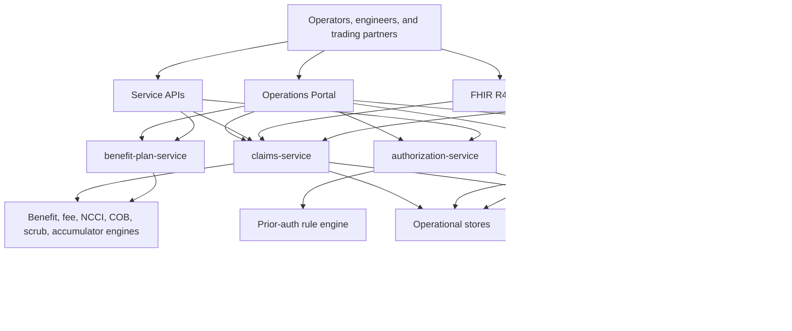
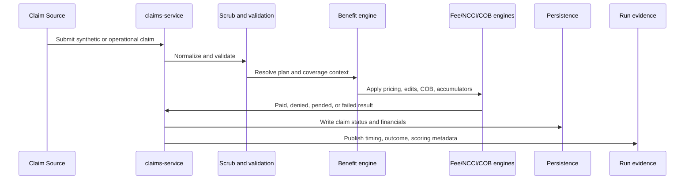
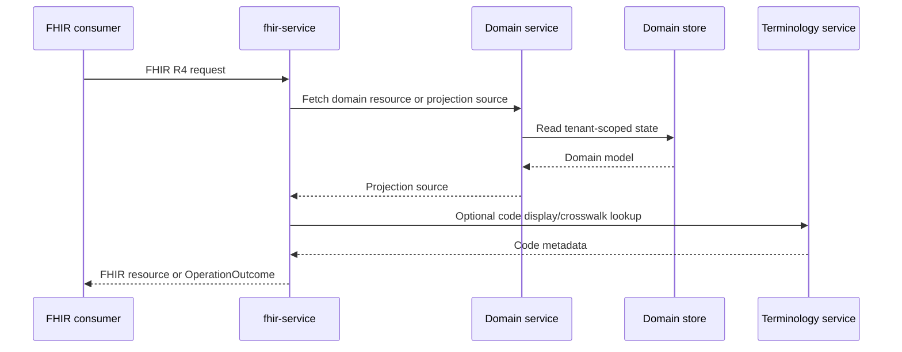
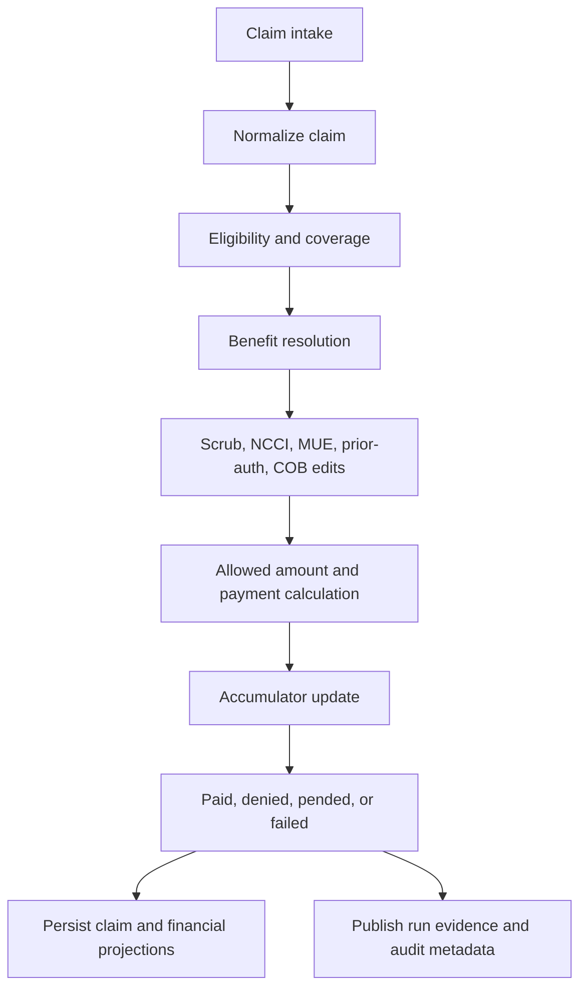
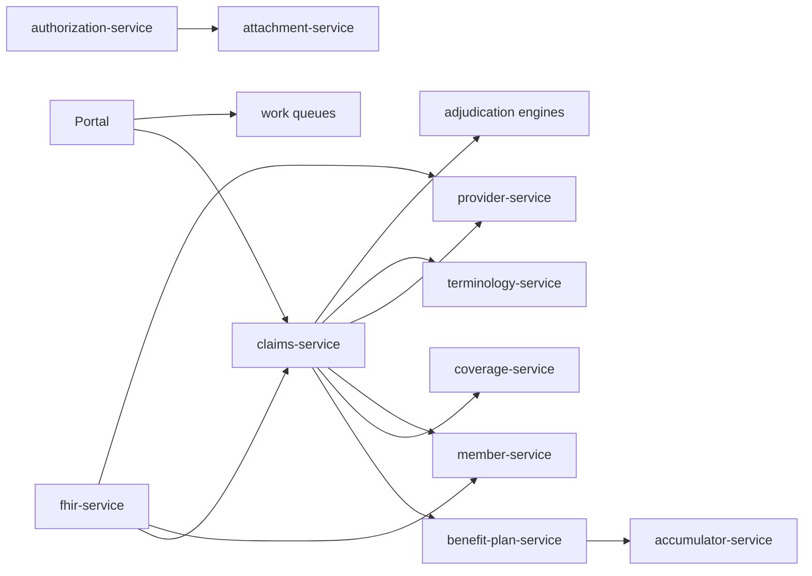
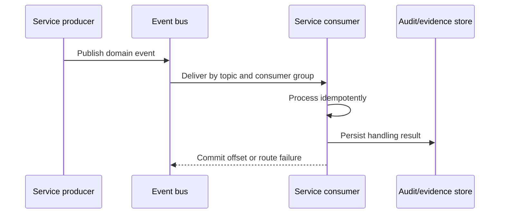
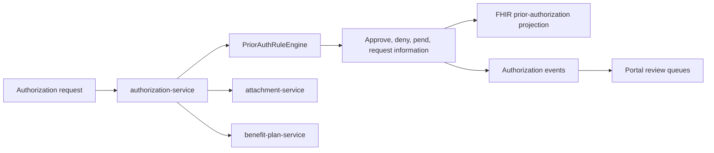
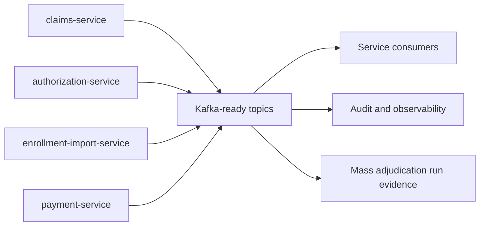
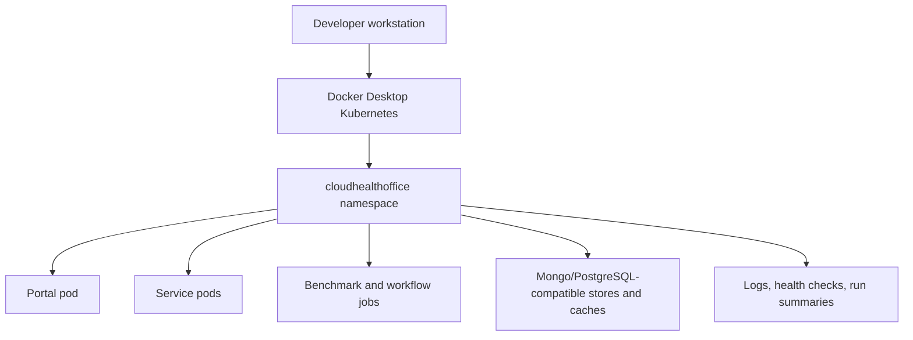
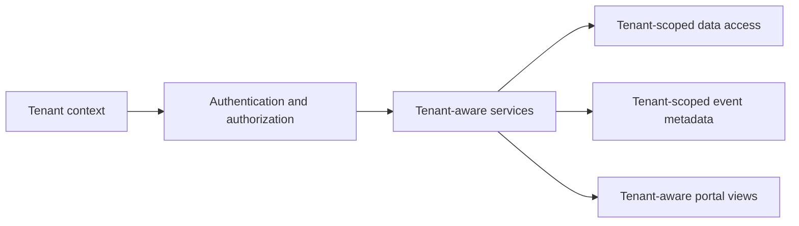

# Architecture

This section maps CloudHealthOffice from system-level shape to service-level
responsibilities. The architecture is Kubernetes-first, API-first, and oriented
around auditable healthcare workflows.

CloudHealthOffice is source-available under BSL 1.1. The diagrams below describe
the repository architecture and current direction; they are not a production
deployment guarantee.

## Architecture Map

| Topic | Start here |
| --- | --- |
| System architecture | [ARCHITECTURE.md](ARCHITECTURE.md) |
| Claims processing pipeline | [claim-adjudication-pipeline.md](claim-adjudication-pipeline.md), [ADJUDICATION-PIPELINE.md](ADJUDICATION-PIPELINE.md) |
| FHIR integration | [fhir-conformance.md](fhir-conformance.md), [fhir-endpoint-projection.md](fhir-endpoint-projection.md), [claim-fhir-projection.md](claim-fhir-projection.md) |
| X12 processing | [837 claims pipeline](../features/837-CLAIMS-PIPELINE.md), [834 enrollment](../features/834-IMPLEMENTATION-SUMMARY.md), [276/277](../features/276-277-IMPLEMENTATION-COMPLETE.md), [277 value-adds](../features/VALUEADDS277-README.md) |
| Event flow | [shared-messagebus.md](shared-messagebus.md) |
| Authorization flow | [Prior Authorization API](../features/PRIOR-AUTHORIZATION-API.md), [authorization request](../features/AUTHORIZATION-REQUEST.md), [authorization inquiry](../features/AUTHORIZATION-INQUIRY.md) |
| Sentinel and rules | [declarative-benefit-model.md](declarative-benefit-model.md), [claim-ai-examination.md](claim-ai-examination.md), [claim-scrubbing-pipeline.md](claim-scrubbing-pipeline.md) |
| Benefit administration | [declarative-benefit-model.md](declarative-benefit-model.md), [benefit-plan-adapter-pattern.md](benefit-plan-adapter-pattern.md), [plan-versioning.md](plan-versioning.md) |
| Accumulators | [accumulator-service.md](accumulator-service.md), [family-accumulator-models.md](family-accumulator-models.md) |
| Multi-tenant model | [network-as-organization.md](network-as-organization.md), [SFTP multi-tenant architecture](SFTP-MULTI-TENANT-ARCHITECTURE.md), [multi-tenant SaaS architecture](../features/MULTI-TENANT-SAAS-ARCHITECTURE.md) |
| Deployment architecture | [deployment guide](../deployment/DEPLOYMENT.md), [Kubernetes microservices architecture](../features/KUBERNETES-MICROSERVICES-ARCHITECTURE.md) |
| Observability | [observability.md](observability.md), [monitoring guide](../features/MONITORING-AND-OBSERVABILITY.md) |

## Overall Platform

## Claims Lifecycle

## FHIR API Interactions

## Claim Adjudication Detail

## Service Dependencies

## Event Processing

## Authorization Flow

## Event Flow

## Deployment Topology

## Tenant Isolation

## Extension Points

- Add service adapters around existing payer systems instead of coupling portal
  workflows directly to legacy databases.
- Add adjudication rules through engine-specific tests and deterministic claim
  fixtures.
- Add FHIR projections from persisted domain models with explicit conformance
  documentation.
- Add X12 workflows as parse, validate, normalize, persist, and publish stages.
- Add benchmark scenarios through the generator, answer key, validator, and
  evidence docs together.
