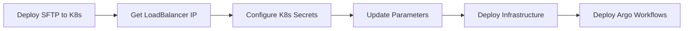

# SFTP + Argo Workflows Quick Reference

## 🚀 Deployment Flow



## 📋 Step-by-Step Commands

### 0. Create AKS Cluster (if needed)
```bash
# Only needed if you don't have a Kubernetes cluster
./scripts/deploy-aks-cluster.sh

# This creates an AKS cluster suitable for validation with:
# - 2-5 autoscaling nodes
# - Azure CNI networking
# - Standard LoadBalancer
# - Azure Monitor integration
# - Estimated cost: ~$150-200/month
```

### 1. Deploy SFTP Server
```bash
./scripts/deploy-sftp-server.sh
```

### 2. Get SFTP IP Address
```bash
export SFTP_IP=$(kubectl get svc sftp-service -n cho-sftp -o jsonpath='{.status.loadBalancer.ingress[0].ip}')
echo "SFTP Server: $SFTP_IP"
```

### 3. Store Password in Key Vault
```bash
# Create or update Key Vault
az keyvault create \
  --name cho-secrets \
  --resource-group rg-hipaa-aks \
  --location westus2

# Store SFTP password
az keyvault secret set \
  --vault-name cho-secrets \
  --name sftp-logicapp-password \
  --value "YourSecurePassword123"
```

### 4. Configure API Connection
```bash
./scripts/configure-sftp-connection.sh
```

**Or manually**:
```bash
az deployment group create \
  --resource-group rg-hipaa-aks \
  --template-file infra/main.bicep \
  --parameters \
    baseName=cho-prod \
    sftpHost=$SFTP_IP \
    sftpUsername=logicapp \
    sftpPassword="@Microsoft.KeyVault(SecretUri=https://cho-secrets.vault.azure.net/secrets/sftp-logicapp-password/)"
```

### 5. Test SFTP Connection
```bash
# Direct SFTP test
sftp logicapp@$SFTP_IP

# Test Azure API connection
az resource invoke-action \
  --resource-group rg-hipaa-aks \
  --resource-type Microsoft.Web/connections \
  --name cho-prod-sftp \
  --action testConnection \
  --api-version 2016-06-01
```

### 6. Deploy Argo Workflows
```bash
./scripts/deploy-workflows.sh
```

## 🔐 Security Checklist

- [ ] Changed default SFTP password from `changeme123`
- [ ] Stored password in Azure Key Vault
- [ ] Updated `infra/main.parameters.json` with KeyVault reference
- [ ] Configured LoadBalancer source IP restrictions
- [ ] Pinned SSH host key fingerprint (production only)
- [ ] Enabled PersistentVolume snapshots/backups
- [ ] Set up Azure Monitor alerts

## 📂 Default Directory Structure

| User | Directory | Purpose |
|------|-----------|---------|
| `logicapp` | `/home/logicapp/upload` | EDI files **TO** clearinghouses |
| `logicapp` | `/home/logicapp/download` | EDI files **FROM** clearinghouses |
| `clearinghouse` | `/home/clearinghouse/edi` | Bi-directional exchange |

## 🛠️ Common Operations

### Change SFTP Password
```bash
# Generate base64 encoded user entry
echo "logicapp:NewPassword123:1000:100:upload" | base64

# Edit secret
kubectl edit secret sftp-users -n cho-sftp

# Restart pods
kubectl rollout restart deployment/sftp-server -n cho-sftp
```

### View SFTP Logs
```bash
kubectl logs -n cho-sftp -l app=sftp-server -f
```

### Check Storage Usage
```bash
kubectl exec -n cho-sftp deployment/sftp-server -- df -h /home
```

### Backup SFTP Files
```bash
POD=$(kubectl get pod -n cho-sftp -l app=sftp-server -o jsonpath='{.items[0].metadata.name}')
kubectl cp cho-sftp/$POD:/home ./sftp-backup/
```

### Delete SFTP Server
```bash
kubectl delete namespace cho-sftp
```

## 🔍 Troubleshooting

| Issue | Check | Fix |
|-------|-------|-----|
| LoadBalancer IP pending | `kubectl get svc -n cho-sftp` | Use NodePort or install MetalLB |
| Connection refused | `kubectl get pods -n cho-sftp` | Check pod status, network policies |
| Authentication failed | `kubectl logs -n cho-sftp -l app=sftp-server` | Verify password in secret |
| Argo Workflows can't connect | Verify K8s secret and pod connectivity | Re-run configure-sftp-connection.sh |
| Files not appearing | `kubectl exec -n cho-sftp deployment/sftp-server -- ls -la /home/logicapp/upload` | Check permissions, verify upload path |

## 📊 Monitoring Queries

### Application Insights (Argo Workflows)
```kusto
customEvents
| where name == "SFTP_Upload_Success" or name == "SFTP_Upload_Failed"
| summarize Count=count() by name, bin(timestamp, 1h)
| render timechart
```

### Kubernetes Events
```bash
kubectl get events -n cho-sftp --sort-by='.lastTimestamp'
```

## 🔗 Related Files

| File | Purpose |
|------|---------|
| [k8s/sftp-server-deployment.yaml](k8s/sftp-server-deployment.yaml) | Kubernetes manifest |
| [scripts/deploy-sftp-server.sh](scripts/deploy-sftp-server.sh) | Deployment automation |
| [scripts/configure-sftp-connection.sh](scripts/configure-sftp-connection.sh) | API connection setup |
| [infra/main.bicep](infra/main.bicep#L368-L383) | SFTP API connection resource |
| [infra/main.parameters.example.json](infra/main.parameters.example.json) | Parameter template |
| [docs/SFTP-INTEGRATION-GUIDE.md](docs/SFTP-INTEGRATION-GUIDE.md) | Full documentation |

## ⚡ One-Liner Deployment

```bash
./scripts/deploy-sftp-server.sh && \
export SFTP_IP=$(kubectl get svc sftp-service -n cho-sftp -o jsonpath='{.status.loadBalancer.ingress[0].ip}') && \
az keyvault secret set --vault-name cho-secrets --name sftp-logicapp-password --value "SecurePass123" && \
./scripts/configure-sftp-connection.sh
```

## 📞 Support

- **K8s Issues**: `kubectl describe pod -n cho-sftp`
- **Azure Issues**: Check Azure Portal → Resource → Activity Log
- **Argo Workflows**: Application Insights → Live Metrics
- **SFTP Logs**: `kubectl logs -n cho-sftp -l app=sftp-server -f`
