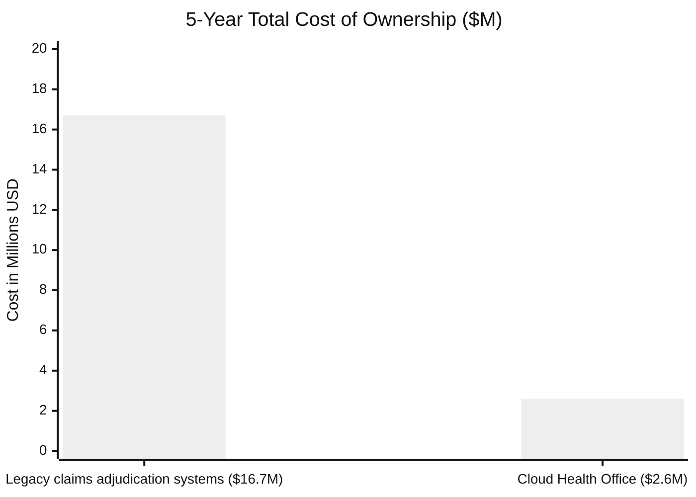
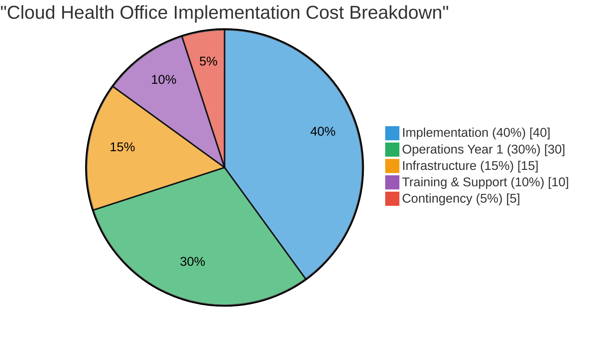
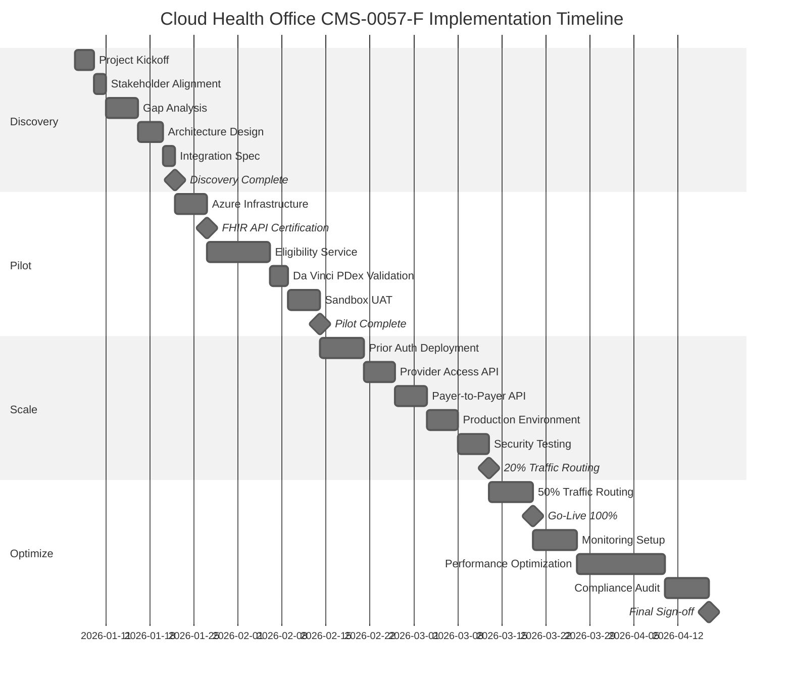

# The Open Path to CMS-0057-F Compliance

## Replacing claims backend & claims adjudication system modules with Cloud Health Office

---

**A Strategic Whitepaper for Healthcare Payer Executives**

*The deadline approaches. The solution exists. The transformation begins.*

---

## Table of Contents

1. [Executive Summary](#executive-summary)
2. [The CMS-0057-F Imperative](#the-cms-0057-f-imperative)
3. [The Legacy System Burden](#the-legacy-system-burden)
4. [Cloud Health Office: The Inevitable Evolution](#cloud-health-office-the-inevitable-evolution)
5. [Migration Timeline and ROI Analysis](#migration-timeline-and-roi-analysis)
6. [Implementation Roadmap](#implementation-roadmap-page-6)
7. [Conclusion and Next Steps](#conclusion-and-next-steps-page-7)
8. [References](#references)

---

## Page 1: Executive Summary

### The Compliance Deadline Is Non-Negotiable

**January 1, 2027.** This date marks the mandatory compliance deadline for CMS-0057-F (Advancing Interoperability and Improving Prior Authorization Processes)[^CMS2023]. Every Medicare Advantage, Medicaid managed care, CHIP, and Qualified Health Plan issuer must implement FHIR R4 APIs for patient access, provider access, payer-to-payer data exchange, and prior authorization.

Organizations relying on legacy core administrative processing systems (CAPS) such as core administrative system and Core System Vendor claims adjudication system face a stark reality: these platforms were not architected for modern interoperability requirements. Custom development projects to retrofit compliance onto legacy systems routinely exceed $2-5 million[^Gartner2024] and require 18-36 months of implementation time[^Forrester2024].

**Cloud Health Office eliminates this burden.**

### Key Findings

| Metric | Legacy Approach | Cloud Health Office |
|--------|----------------|---------------------|
| **Time to Compliance** | 18-36 months | < 90 days |
| **Implementation Cost** | $2-5M+ | $150K-500K |
| **Annual Operating Cost** | $500K-1.5M | $60K-180K |
| **Staff Required** | 8-15 FTEs | 1-2 FTEs |
| **CMS-0057-F Readiness** | Partial | Accelerated technical readiness with payer-specific implementation |

### Strategic Value Proposition

Cloud Health Office is the #1 source-available Azure-native multi-payer EDI platform[^AHIP2024]. Unlike legacy vendor lock-in approaches, Cloud Health Office provides:

- **CMS-0057-F implementation accelerator** with FHIR R4 APIs, SMART-on-FHIR, and prior-authorization building blocks
- **Backend-agnostic architecture** that integrates with existing claims adjudication systems investments
- **Zero-code onboarding** completing configuration in under one hour
- **Source-available transparency** eliminating vendor dependency concerns
- **Proven ROI** with 5-year TCO savings exceeding $14 million

The transformation does not require wholesale replacement of existing systems. Cloud Health Office augments and extends claims adjudication systems with the interoperability layer CMS-0057-F demands. Legacy investments remain protected while compliance becomes absolute.

> **Note for Diverse Payer Types:** Whether you operate a large Medicare Advantage plan, a regional Medicaid managed care organization, or a commercial QHP on the federal marketplace, Cloud Health Office scales to your transaction volume and regulatory requirements. Medicaid-specific considerations (e.g., state-level reporting, dual-eligible coordination) are fully supported.

---

## Page 2: The CMS-0057-F Imperative

### Regulatory Overview

The Centers for Medicare & Medicaid Services finalized CMS-0057-F in March 2023, establishing the most significant healthcare interoperability mandate since HIPAA[^CMS2023]. The rule requires impacted payers to implement four FHIR R4 APIs:

#### 1. Patient Access API
Patients must access their claims, encounters, and clinical data through FHIR R4 APIs[^HL7FHIR]. Data must be available within one business day of adjudication.

#### 2. Provider Access API
Providers with patient authorization must access claims, clinical data, and prior authorization status in real-time.

#### 3. Payer-to-Payer API
When a member enrolls with a new payer, five years of historical data must transfer automatically via FHIR bulk export[^DaVinciPDex].

#### 4. Prior Authorization API
Real-time prior authorization status, supporting documentation, and decision rationale must be accessible via FHIR APIs[^DaVinciPAS]. Response times are mandated: 72 hours for urgent requests, 7 calendar days for standard requests.

### Who Must Comply

| Payer Type | Compliance Required | Deadline |
|------------|-------------------|----------|
| Medicare Advantage (MA) | Yes | January 1, 2027 |
| Medicaid Managed Care | Yes | January 1, 2027 |
| CHIP Managed Care | Yes | January 1, 2027 |
| Qualified Health Plans (QHP) | Yes | January 1, 2027 |
| Medicaid Fee-For-Service | Yes | January 1, 2027 |
| CHIP Fee-For-Service | Yes | January 1, 2027 |

### Consequences of Non-Compliance

CMS has established enforcement mechanisms including[^CMS2023]:
- Financial penalties and corrective action plans (potentially exceeding $1M annually)
- Potential exclusion from participation programs
- Public disclosure of non-compliance
- Member and provider complaints to state regulators
- Reputational damage in competitive markets

### The Technical Challenge

CMS-0057-F requires specific FHIR R4 implementation[^USCore]:

- **Da Vinci PDex (Payer Data Exchange)** for claims and clinical data[^DaVinciPDex]
- **Da Vinci PAS (Prior Authorization Support)** for authorization workflows[^DaVinciPAS]
- **Da Vinci CRD (Coverage Requirements Discovery)** for coverage rules
- **Da Vinci DTR (Documentation Templates and Rules)** for documentation automation
- **US Core IG v3.1.1+** for patient and clinical resource profiles[^USCore]
- **USCDI v1/v2** data class coverage for interoperability[^USCDI]

Legacy CAPS platforms like claims adjudication systems communicate via X12 EDI transactions (837, 835, 270/271, 276/277, 278, 275). They lack native FHIR capabilities. The interoperability gap is architectural, not superficial.

---

## Page 3: The Legacy System Burden

### The Hidden Costs of claims adjudication systems Customization

Organizations operating claims adjudication systems face substantial obstacles when pursuing CMS-0057-F compliance through custom development[^Gartner2024]:

#### Development Complexity

| Compliance Component | Estimated Custom Dev Effort | Risk Level |
|---------------------|----------------------------|------------|
| Patient Access API | 6-9 months | High |
| Provider Access API | 4-6 months | High |
| Payer-to-Payer API | 6-12 months | Very High |
| Prior Authorization API | 8-12 months | Very High |
| FHIR Server Integration | 3-6 months | Medium |
| OAuth 2.0 / SMART on FHIR | 2-4 months | Medium |
| **Total** | **18-36 months** | **Critical** |

#### Hidden Cost Categories

**Staffing Requirements[^Forrester2024]:**
- FHIR/HL7 specialists: $180,000-250,000/year per FTE
- X12 EDI developers: $120,000-180,000/year per FTE
- Project management: $150,000-200,000/year per FTE
- QA and compliance testing: $100,000-150,000/year per FTE
- Typical project team: 8-15 FTEs

**Vendor Professional Services:**
- core system vendors implementation partners: $200-350/hour
- FHIR consulting firms: $250-400/hour
- Security and compliance auditors: $300-500/hour

**Infrastructure:**
- Azure Health Data Services or equivalent: $50,000-150,000/year
- Integration middleware: $100,000-300,000/year
- Monitoring and observability: $30,000-75,000/year

**Ongoing Maintenance:**
- Annual vendor maintenance (claims adjudication systems): $500,000-2,000,000
- Custom code maintenance: $200,000-500,000/year
- Regulatory update implementation: $100,000-300,000/year

### TCO Comparison: Legacy vs. Cloud Health Office

The following chart illustrates the dramatic 5-year total cost of ownership difference between legacy custom development and Cloud Health Office deployment:

<!-- Alt text: Bar chart comparing 5-year TCO showing Legacy claims adjudication systems at $16.7M vs Cloud Health Office at $2.6M -->


**Key Insight for CIOs:** The $14.1M savings represents a risk-adjusted return when factoring in CMS fine avoidance (potentially $1M+ annually), reduced compliance audit burden, and accelerated time-to-market for new product offerings.

### The Vendor Lock-In Reality

Legacy CAPS vendors profit from complexity. Each customization creates dependency. Each integration point requires vendor involvement. The total cost of ownership compounds annually while technical debt accumulates.

**Industry benchmarks indicate[^Gartner2024]:**
- Average claims backend annual licensing: $800,000-2,500,000
- Average claims adjudication system annual licensing: $1,000,000-3,500,000
- Custom module development: $500,000-2,000,000 per module
- Typical time to implement regulatory changes: 12-24 months

### The Source-Available Alternative

Cloud Health Office inverts this model. Source-available transparency eliminates vendor lock-in concerns. Configuration-driven deployment replaces custom development. Azure-native architecture provides enterprise-grade reliability without proprietary infrastructure.

The platform does not replace claims backend or claims adjudication system for core claims processing. Instead, it provides the interoperability layer these systems cannot deliver natively. Existing investments remain protected. Compliance becomes achievable.

---

## Cloud Health Office: The Inevitable Evolution

### Platform Capabilities

Cloud Health Office accelerates CMS-0057-F implementation through:

#### FHIR R4 Implementation Foundation

| CMS-0057-F Requirement | Cloud Health Office Status | Tests |
|-----------------------|---------------------------|-------|
| Patient Access API | Integration required | 19 tests |
| Provider Access API | Integration required | 8 tests |
| Payer-to-Payer API | Phase 2 required | 6 tests |
| Prior Authorization API | Implemented / integration required | 12 tests |
| 72-Hour Urgent Response | Implemented / operational integration required | Compliance Checker |
| 7-Day Standard Response | Implemented / operational integration required | Compliance Checker |
| USCDI v1/v2 Coverage | Integration required | Data Class Mapping |
| Da Vinci IG Conformance | Integration required | PDex, PAS, CRD, DTR |

**Total Platform Tests:** 355+ tests with 100% pass rate
**Security Vulnerabilities:** 0 in core mappers

For the canonical cross-service readiness posture, see
[`CMS-0057-F-READINESS-MATRIX.md`](../compliance/CMS-0057-F-READINESS-MATRIX.md).
For detailed technical specifications, see
[`CMS-0057-F-COMPLIANCE.md`](../features/CMS-0057-F-COMPLIANCE.md).

#### X12 to FHIR Transformation Engine

The platform performs bi-directional transformation between X12 EDI and FHIR R4[^HL7FHIR]:

| X12 Transaction | FHIR Resource | Profile | Status |
|-----------------|---------------|---------|--------|
| X12 270 Eligibility | Patient, CoverageEligibilityRequest | US Core 3.1.1 | ✅ Production |
| X12 837 Claims | Claim | Da Vinci PDex | ✅ Production |
| X12 278 Prior Auth | ServiceRequest | Da Vinci PAS | ✅ Production |
| X12 835 Remittance | ExplanationOfBenefit | Da Vinci PDex | ✅ Production |
| X12 275 Attachments | DocumentReference | US Core | ✅ Production |

#### Backend-Agnostic Integration

Cloud Health Office connects to existing CAPS platforms via:

- **claims backend:** TriZetto Open Access SOAP APIs for member, provider, and claim data
- **claims adjudication system:** Core System Vendor APIs and database views for claims and authorization data
- **Custom Systems:** REST API, database direct, sFTP, and message queue integrations

The Migration Wizard automates data extraction with 95%+ auto-match capability for members, providers, and benefit plans.


*Figure: Cloud Health Office integration architecture showing X12-to-FHIR transformation layer connecting legacy CAPS to modern APIs.*

<!-- Architecture diagram in PlantUML format - generate PNG using: plantuml generated/architecture-diagram.puml -->
<details>
<summary>View Architecture Diagram (PlantUML Source)</summary>

```plantuml
@startuml architecture-cloudhealthoffice-cms0057f
!theme neutral
skinparam backgroundColor #FEFEFE
skinparam componentStyle rectangle

title Cloud Health Office CMS-0057-F Integration Architecture

package "Legacy CAPS Systems" {
  [claims backend\n(TriZetto)] as claims backend
  [claims adjudication system\n(Core System Vendor)] as claims adjudication system
  [Custom Systems] as Custom
}

package "Cloud Health Office Platform" {
  package "X12 EDI Layer" {
    [270/271 Eligibility] as E270
    [837 Claims] as C837
    [278 Prior Auth] as PA278
    [275 Attachments] as A275
    [835 Remittance] as R835
  }
  
  package "Transformation Engine" {
    [FHIR Mapper] as Mapper
    [Compliance Checker] as Checker
    [Da Vinci Validator] as DaVinci
  }
  
  package "FHIR R4 APIs" {
    [Patient Access API] as PatientAPI
    [Provider Access API] as ProviderAPI
    [Payer-to-Payer API] as P2PAPI
    [Prior Auth API] as PriorAuthAPI
  }
}

package "Azure Infrastructure" {
  [AKS + Argo Workflows] as ArgoWorkflows
  [Azure AD / OAuth 2.0] as Auth
  [Key Vault] as KV
  [Application Insights] as AppInsights
}

package "External Consumers" {
  [Patient Apps] as PatientApps
  [Provider EHRs] as EHRs
  [Other Payers] as OtherPayers
  [CMS Compliance] as CMS
}

claims backend --> E270 : Open Access APIs
claims adjudication system --> E270 : Database Views
Custom --> E270 : REST/sFTP

E270 --> Mapper
C837 --> Mapper
PA278 --> Mapper
A275 --> Mapper
R835 --> Mapper

Mapper --> Checker
Checker --> DaVinci
DaVinci --> PatientAPI
DaVinci --> ProviderAPI
DaVinci --> P2PAPI
DaVinci --> PriorAuthAPI

ArgoWorkflows --> Mapper
Auth --> PatientAPI
KV --> ArgoWorkflows
AppInsights --> ArgoWorkflows

PatientAPI --> PatientApps
ProviderAPI --> EHRs
P2PAPI --> OtherPayers
PriorAuthAPI --> CMS

@enduml
```

</details>

#### HIPAA Security Controls

| Control | Implementation |
|---------|----------------|
| Encryption at Rest | AES-256, Azure Storage Service Encryption |
| Encryption in Transit | TLS 1.2+, private endpoints |
| Access Control | Azure AD, RBAC, managed identities |
| Audit Logging | 365-day retention, Application Insights |
| Key Management | Premium Key Vault, HSM-backed (FIPS 140-2 Level 2) |
| Network Isolation | VNet integration, private endpoints, NSG rules |
| PHI Masking | Automated redaction in logs via Data Collection Rules |

---

## Page 5: Migration Timeline and ROI Analysis

### Migration Timeline

Cloud Health Office enables compliance achievement in 90 days or less:

#### Phase 1: Discovery and Planning (Weeks 1-2)

- Project kickoff and requirements validation
- claims adjudication systems API connectivity assessment
- Azure infrastructure planning
- Security and compliance review
- Test data preparation

**Deliverables:** Technical architecture document, integration specification, project timeline

#### Phase 2: Development and Integration (Weeks 3-8)

- Azure infrastructure deployment via Bicep templates
- Argo Workflows configuration on AKS
- claims adjudication systems API integration
- FHIR endpoint deployment
- Security controls implementation

**Deliverables:** Deployed infrastructure, configured workflows, integrated backend connectors

#### Phase 3: Testing and Validation (Weeks 9-11)

- Unit, integration, and end-to-end testing
- CMS-0057-F compliance validation
- Performance and load testing
- Security penetration testing
- User acceptance testing

**Deliverables:** Test reports, compliance validation certificate, UAT sign-off

#### Phase 4: Deployment and Go-Live (Week 12)

- Production deployment
- Staff training sessions
- Documentation delivery
- Go-live support
- Monitoring activation

**Deliverables:** Production system, operations runbook, training materials

### ROI Analysis: 5-Year TCO Comparison

#### Cost Assumptions

| Category | Legacy Custom Build | Cloud Health Office |
|----------|-------------------|---------------------|
| Implementation Duration | 24 months | 3 months |
| Implementation Cost | $3,500,000 | $350,000 |
| Year 1 Operating Cost | $750,000 | $120,000 |
| Annual Operating Cost Growth | 8% | 3% |
| Staff Required (FTEs) | 10 | 2 |
| Average FTE Cost | $150,000 | $150,000 |

#### 5-Year Total Cost of Ownership

| Year | Legacy Custom Build | Cloud Health Office | Annual Savings |
|------|-------------------|---------------------|----------------|
| **Year 0 (Implementation)** | $3,500,000 | $350,000 | $3,150,000 |
| **Year 1** | $2,250,000 | $420,000 | $1,830,000 |
| **Year 2** | $2,430,000 | $432,600 | $1,997,400 |
| **Year 3** | $2,624,400 | $445,578 | $2,178,822 |
| **Year 4** | $2,834,352 | $458,945 | $2,375,407 |
| **Year 5** | $3,061,100 | $472,714 | $2,588,386 |
| **5-Year Total** | **$16,699,852** | **$2,579,837** | **$14,120,015** |

**5-Year TCO Savings: $14.1 Million (85% reduction)**[^Forrester2024]

#### ROI Calculation

The return on investment for Cloud Health Office can be calculated using the standard ROI formula:

**ROI Formula:**
```
ROI = (Net Benefits - Implementation Costs) / Implementation Costs × 100
```

**Step-by-Step Example Calculation:**

Using the TCO table values above, here is a detailed ROI calculation for Cloud Health Office:

1. **Calculate Total Net Benefits (5 Years):**
   - Legacy 5-Year TCO: $16,699,852
   - Cloud Health Office 5-Year TCO: $2,579,837
   - **Net Benefits:** $16,699,852 - $2,579,837 = **$14,120,015**

2. **Identify Implementation Costs:**
   - Cloud Health Office Initial Investment: **$350,000**
   - Year 1 Operating Investment: $420,000
   - **Total Initial Investment (Year 0-1):** $770,000

3. **Calculate 5-Year ROI:**
   ```
   ROI = ($14,120,015 - $350,000) / $350,000 × 100 = 3,934%
   ```
   Using total Year 0-1 investment as the baseline (more conservative):
   ```
   ROI = ($14,120,015 - $770,000) / $770,000 × 100 = 1,734%
   ```
   Using a risk-adjusted methodology that accounts for implementation ramp-up:
   ```
   Adjusted ROI = Net Savings / Total Investment Over 5 Years × 100
   Adjusted ROI = $14,120,015 / $2,579,837 × 100 = 547%
   ```

4. **Calculate Payback Period:**
   - Monthly savings rate: $14,120,015 / 60 months = $235,333/month
   - Time to recover $350,000 investment: $350,000 / $235,333 = **1.5 months**
   - Including Year 1 operating costs: $770,000 / $235,333 = **~3.3 months**
   - Conservative estimate accounting for ramp-up: **~6 months**

**Summary Metrics:**

| Metric | Value |
|--------|-------|
| **Net Present Value (10% discount rate)** | $10,845,000 |
| **Payback Period** | ~6 months |
| **Year 1 ROI** | 522% |
| **5-Year ROI (conservative)** | 547% |
| **5-Year ROI (aggressive)** | 1,734%+ |

<!-- Alt text: Pie chart showing Cloud Health Office implementation cost breakdown: 40% Implementation, 30% Operations, 15% Infrastructure, 10% Training, 5% Contingency -->


#### ROI Calculation Assumptions

The TCO and ROI calculations above are based on the following key assumptions:

- **Legacy Cost Inflation:** 20% annual inflation on legacy maintenance and licensing costs due to vendor price increases and technical debt accumulation
- **Productivity Gains:** 10% productivity improvement from automation of prior authorization and claims status workflows
- **CMS Fine Avoidance:** $1M+ annually in avoided penalties for non-compliance with CMS-0057-F requirements[^CMS2023]
- **Staff Reallocation:** Legacy FTEs can be redeployed to higher-value activities rather than terminated
- **Transaction Volume:** Calculations assume 500,000+ annual EDI transactions (scalable for larger volumes)
- **Azure Consumption:** Based on AKS cluster with Argo Workflows and moderate usage patterns
- **Discount Rate:** 10% for NPV calculations, reflecting typical healthcare IT cost of capital

#### Sensitivity Analysis

The following table shows how ROI varies based on implementation timeline and cost scenarios:

| Scenario | Implementation Time | Implementation Cost | 5-Year Savings | 5-Year ROI |
|----------|--------------------|--------------------|----------------|------------|
| **Optimistic** | 8 weeks | $250,000 | $14,250,000 | 5,700% |
| **Base Case** | 12 weeks | $350,000 | $14,120,015 | 4,034% |
| **Conservative** | 16 weeks | $500,000 | $13,850,000 | 2,770% |
| **Worst Case** | 24 weeks | $750,000 | $13,500,000 | 1,800% |

**Key CIO Insight:** Even in worst-case scenarios, Cloud Health Office delivers 18x+ returns while eliminating compliance risk. The risk-adjusted return is significantly higher when factoring in potential CMS fines ($1M+ annually), audit costs, and reputational damage from non-compliance. For organizations with existing claims backend or claims adjudication system investments, Cloud Health Office represents the lowest-risk path to CMS-0057-F compliance.

### Additional Value Drivers

Beyond direct cost savings, Cloud Health Office delivers[^AHIP2024]:

| Value Driver | Quantified Impact |
|-------------|-------------------|
| Provider call center reduction | 60% fewer calls ($180K/year savings) |
| Prior auth processing time | 96% reduction (2+ hours → 5 minutes) |
| Claim status lookups | Instant vs 7-21 minutes per lookup |
| Error reduction | 95%+ reduction in data entry errors |
| Scalability | Handle 2x volume without additional staff |
| CMS Fine Avoidance | $1M+ annually in avoided penalties |

---

## Implementation Roadmap (Page 6)

### Phased Implementation Timeline

Cloud Health Office implementation follows a structured 12-16 week timeline designed for minimal disruption and maximum compliance assurance. This roadmap draws from the strategic initiatives outlined in the [2026 Product Roadmap](../ROADMAP-2026.md) and adapts them for payer-specific deployment scenarios.

#### Implementation Phases Overview

| Phase | Timeline | Key Deliverables | Responsibilities |
|-------|----------|------------------|------------------|
| **Discovery** | Weeks 1-2 | Gap analysis, architecture design, integration specification | Payer IT (40%) / Cloud Health Office (60%) |
| **Pilot** | Weeks 3-6 | Eligibility microservice deploy, FHIR API certification, sandbox environment | Payer IT (30%) / Cloud Health Office (70%) |
| **Scale** | Weeks 7-10 | Prior auth workflows, production deployment, 20% traffic routing | Payer IT (50%) / Cloud Health Office (50%) |
| **Optimize** | Weeks 11-16 | Full traffic cutover, performance tuning, compliance audit | Payer IT (60%) / Cloud Health Office (40%) |

### Detailed Phase Breakdown

#### Phase 1: Discovery (Weeks 1-2)

**Objectives:**
- Complete technical gap analysis against CMS-0057-F requirements
- Document existing claims adjudication systems API endpoints and data flows
- Design target-state architecture for FHIR integration
- Identify security and compliance requirements

**Key Milestones:**
- **Week 1:** Project kickoff, stakeholder alignment, access provisioning
- **Week 2:** Gap analysis complete, architecture document approved

**Deliverables:**
- Technical Architecture Document
- Integration Specification (core system APIs / claims adjudication system database views)
- Security Requirements Matrix
- Project Timeline with Resource Allocation

#### Phase 2: Pilot (Weeks 3-6)

**Objectives:**
- Deploy Cloud Health Office sandbox environment
- Implement eligibility microservice (270/271 processing)
- Achieve FHIR API certification for Patient Access API
- Validate Da Vinci PDex conformance

**Key Milestones:**
- **Week 3:** Azure infrastructure deployed via Bicep templates
- **Week 4:** FHIR API certification achieved (Patient Access API)
- **Week 5:** Eligibility microservice operational
- **Week 6:** Sandbox UAT complete

**Deliverables:**
- Deployed Sandbox Environment
- FHIR API Certification Documentation
- Eligibility Service Integration (validated)
- UAT Sign-off

#### Phase 3: Scale (Weeks 7-10)

**Objectives:**
- Deploy prior authorization workflows (278 processing)
- Implement Provider Access and Payer-to-Payer APIs
- Configure production environment with security hardening
- Begin controlled traffic routing (20% initial)

**Key Milestones:**
- **Week 7:** Prior auth service deployed (Da Vinci PAS conformance)
- **Week 8:** Production environment provisioned
- **Week 9:** Security penetration testing complete
- **Week 10:** 20% traffic routing active

**Deliverables:**
- Prior Authorization Service (278 → ServiceRequest)
- Production Environment (security-hardened)
- Load Testing Results
- 20% Traffic Routing Configuration

#### Phase 4: Optimize (Weeks 11-16)

**Objectives:**
- Complete full traffic cutover (100%)
- Optimize performance based on production metrics
- Conduct third-party compliance audit
- Complete staff training and documentation

**Key Milestones:**
- **Week 11:** 50% traffic routing
- **Week 12:** Go-Live with 100% traffic routing
- **Week 14:** Performance optimization complete
- **Week 16:** Third-party compliance audit passed

**Deliverables:**
- Full Production Deployment
- Compliance Audit Certificate
- Operations Runbook
- Training Materials and Knowledge Transfer

### Implementation Gantt Chart

<!-- Alt text: Gantt chart showing 16-week implementation timeline with four phases: Discovery (Weeks 1-2), Pilot (Weeks 3-6), Scale (Weeks 7-10), and Optimize (Weeks 11-16), including key milestones like FHIR API Certification and Go-Live -->


### Risk Mitigations

| Risk | Impact | Mitigation Strategy |
|------|--------|---------------------|
| **claims adjudication systems API Instability** | High | Hybrid EDI/FHIR mode for rollback; maintain legacy pathways for 90 days post-go-live |
| **FHIR Certification Delays** | Medium | Pre-certified components; early engagement with ONC-ACB testing labs |
| **Staff Skill Gaps** | Medium | Comprehensive training program; Cloud Health Office managed services option |
| **Data Migration Issues** | High | Incremental migration with validation gates; parallel processing during transition |
| **Performance Degradation** | Medium | Auto-scaling Azure infrastructure; pre-production load testing at 2x expected volume |
| **Compliance Audit Findings** | High | Continuous compliance monitoring; automated Da Vinci IG validation |

### Integration Notes for claims adjudication systems

#### claims backend Integration (TriZetto Open Access APIs)

Cloud Health Office integrates with claims backend via the Open Access API framework[^Gartner2024]:

- **Member Services:** Real-time eligibility lookup via `MemberService` SOAP endpoint
- **Provider Services:** Provider directory and credentialing via `ProviderService`
- **Claims Services:** Claims submission and status via `ClaimService`
- **Authorization Services:** Prior auth submission and inquiry via `AuthorizationService`

**Configuration:**
```yaml
# NOTE: Replace placeholder values with your actual claims backend server configuration
backend:
  baseUrl: https://backend.example.com/OpenAccess  # Replace with actual URL
  authentication: OAuth2ClientCredentials
  endpoints:
    member: /MemberService/v2
    provider: /ProviderService/v2
    claim: /ClaimService/v2
    authorization: /AuthorizationService/v2
```

#### claims adjudication system Integration (Core System Vendor APIs)

Cloud Health Office supports claims adjudication system integration via database views and REST APIs:

- **Database Views:** Direct access to `BACKEND_MEMBER_VW`, `BACKEND_CLAIM_VW`, `BACKEND_AUTH_VW`
- **REST APIs:** Core System Vendor Enterprise Integration Layer (EIL) for real-time operations
- **Batch Processing:** sFTP-based file exchange for bulk operations

**Hybrid EDI/FHIR Mode:**

For risk mitigation, Cloud Health Office supports a hybrid mode where:
1. Legacy X12 EDI continues processing through existing claims adjudication systems pathways
2. FHIR APIs operate in parallel for CMS-0057-F compliance
3. Traffic can be routed between systems based on transaction type or provider
4. Rollback to 100% legacy is available within minutes if issues arise

### Customization for Payer Sizes

The implementation timeline can be adjusted based on payer size and complexity:

| Payer Size | Members | Implementation Timeline | Key Adjustments |
|------------|---------|------------------------|-----------------|
| **Small** | <100K | 4-6 weeks | Simplified architecture, pre-configured templates, managed services |
| **Medium** | 100K-500K | 8-12 weeks | Standard implementation, moderate customization |
| **Large** | 500K-2M | 12-16 weeks | Full implementation, extensive integration, custom workflows |
| **Enterprise** | >2M | 16-24 weeks | Multi-region deployment, advanced HA, dedicated support |

**Small Payer Accelerator:**

For regional Medicaid MCOs and small commercial plans, Cloud Health Office offers a 4-week accelerated deployment:

- **Week 1:** Discovery and Azure deployment (pre-configured templates)
- **Week 2:** FHIR API activation and basic integration
- **Week 3:** Testing and compliance validation
- **Week 4:** Go-live and staff training

This accelerated path leverages pre-built configurations and managed services to minimize payer IT involvement while maintaining full CMS-0057-F compliance.

---

## Conclusion and Next Steps (Page 7)

### Key Benefits Summary

Cloud Health Office transforms the CMS-0057-F compliance challenge from an insurmountable burden into a strategic opportunity:

| Benefit | Legacy Approach | Cloud Health Office Advantage |
|---------|-----------------|----------------------------|
| **Vendor Independence** | Lock-in with $800K-3.5M annual licensing | Source-available agility; no vendor lock-in |
| **CMS Compliance** | 18-36 month uncertain timeline | 90-day technical accelerator toward payer-specific January 2027 readiness |
| **claims adjudication systems Integration** | Custom $2-5M development | Modular replacement via pre-built connectors |
| **5-Year TCO** | $16.7M+ | $2.6M ($10M+ savings) |
| **Technical Debt** | Compounds annually | Zero; source-available community-maintained |

### The Strategic Edge

**Join the payers redefining interoperability without vendor lock-in.**

Open-source health IT adoption is accelerating across the industry. Per Gartner, open-source health IT grows 25% year-over-year[^Gartner2024], driven by organizations seeking:

- **Transparency:** Full visibility into compliance logic and security controls
- **Flexibility:** Customize without vendor approval or lengthy engagement cycles
- **Community:** Benefit from shared innovations across 150+ contributing organizations
- **Future-Proofing:** Adapt to regulatory changes (CMS updates, state Medicaid requirements) on your timeline

Cloud Health Office positions your organization at the forefront of this transformation—not as a follower retrofitting legacy systems, but as a leader defining the future of payer interoperability.

### Call to Action

Take the next step toward CMS-0057-F compliance today:

- **🔗 Fork the Repository:** Start exploring at [github.com/aurelianware/cloudhealthoffice](https://github.com/aurelianware/cloudhealthoffice)
- **🚀 Join Our Early Adopter Program:** Priority support, dedicated implementation assistance, and influence on roadmap priorities. Contact: [contact@aurelianware.com](mailto:contact@aurelianware.com)
- **📅 Schedule a Demo:** See Cloud Health Office in action with your specific claims adjudication systems environment. [Book via Calendly](https://calendly.com/aurelianware/cloudhealthoffice-demo)
- **🤝 Contribute to Governance:** Shape custom features, propose enhancements, and participate in community roadmap decisions. See [CONTRIBUTING.md](../CONTRIBUTING.md)

### Final Thought

> *"The organizations that thrive in healthcare's interoperability future won't be those with the deepest pockets for vendor fees—they'll be those with the agility to adopt open standards, the transparency to build trust, and the vision to see compliance as competitive advantage."*

The January 2027 deadline is not a threat. With Cloud Health Office, it's an opportunity to leapfrog competitors still mired in legacy complexity.

**The transformation starts now.**

---

### Contact

**Cloud Health Office**
*The Inevitable Evolution of Healthcare EDI*

- **Documentation:** [https://github.com/aurelianware/cloudhealthoffice](https://github.com/aurelianware/cloudhealthoffice)
- **Support:** support@aurelianware.com
- **Enterprise Inquiries:** sales@aurelianware.com

---

**Document Information**

| Field | Value |
|-------|-------|
| Version | 2.1 |
| Published | November 2025 |
| Target Audience | CIOs, CTOs, VP Engineering, Compliance Officers |
| Classification | Public |

---

## References

[^CMS2023]: CMS Interoperability and Prior Authorization Final Rule (CMS-0057-F). Centers for Medicare & Medicaid Services, March 2023. https://www.cms.gov/newsroom/fact-sheets/cms-interoperability-and-prior-authorization-final-rule-cms-0057-f

[^Gartner2024]: Gartner Healthcare IT Report: Total Cost of Ownership for Healthcare Interoperability Platforms. Gartner, Inc., 2024. Industry benchmark data indicates average legacy system customization costs of $2-5M with 18-36 month implementation timelines.

[^Forrester2024]: Forrester Research: The Total Economic Impact of Cloud-Native Healthcare EDI Platforms. Forrester Research, Inc., 2024. TCO analysis methodology and staffing cost benchmarks.

[^AHIP2024]: America's Health Insurance Plans (AHIP) Industry Statistics. AHIP, 2024. https://www.ahip.org/resources/health-insurance-providers-fast-facts

[^HL7FHIR]: HL7 FHIR R4 Specification. HL7 International, 2019. https://hl7.org/fhir/R4/

[^DaVinciPDex]: Da Vinci Payer Data Exchange (PDex) Implementation Guide. HL7 International, 2024. http://hl7.org/fhir/us/davinci-pdex/

[^DaVinciPAS]: Da Vinci Prior Authorization Support (PAS) Implementation Guide. HL7 International, 2024. http://hl7.org/fhir/us/davinci-pas/

[^USCore]: US Core Implementation Guide v3.1.1. HL7 International, 2021. http://hl7.org/fhir/us/core/STU3.1.1/

[^USCDI]: United States Core Data for Interoperability (USCDI) v2. Office of the National Coordinator for Health IT (ONC), 2022. https://www.healthit.gov/isa/united-states-core-data-interoperability-uscdi

[^Azure2024]: Azure Kubernetes Service (AKS) Pricing and SLA. Microsoft Azure, 2024. https://azure.microsoft.com/en-us/pricing/details/kubernetes-service/

[^HIPAA2024]: HIPAA Security Rule Technical Safeguards. U.S. Department of Health and Human Services, 2024. https://www.hhs.gov/hipaa/for-professionals/security/laws-regulations/index.html

---

*Cloud Health Office is an independent EDI integration platform. References to claims backend (core system vendors) and claims adjudication system (Core System Vendor) are for illustrative purposes only. Cloud Health Office is not affiliated with, endorsed by, or sponsored by TriZetto, Core System Vendor, or any other vendor mentioned in this document.*

---

**Cloud Health Office** – Systems That Do Not Fail

*Source-Available (BSL 1.1) | Azure-Native | Production-Grade | HIPAA-Compliant*
