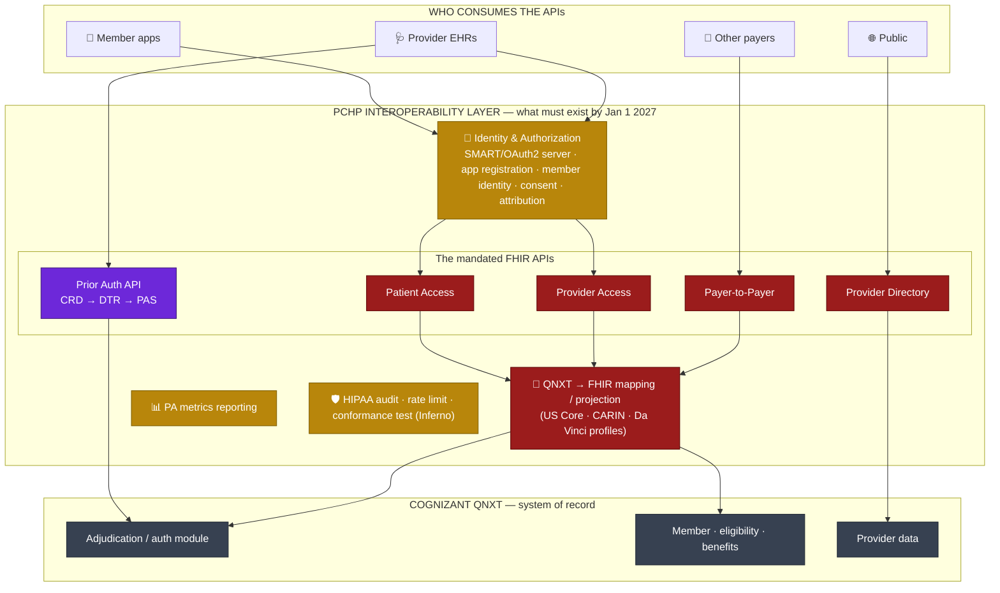

# PCHP CMS-0057-F — Architect's Build/Buy/Gap Map

> PCHP (Parkland Community Health Plan) architect view. Vendor-neutral. Question:
> **if we use Cognizant (QNXT) and/or Itiliti, what does PCHP still need to build and own?**
> CHO is intentionally left out here; it's a candidate to thread into the gaps later.

---

## 1. The obligation is PCHP's — vendors only discharge parts of it

CMS-0057-F applies to PCHP as a Medicaid MCO. You can delegate *implementation* to vendors,
but the **attestation, the data, and the integration seams stay yours.** Two waves:

| Requirement | Deadline | Already live? (today ≈ mid-2026) |
|---|---|---|
| PA decision timeframes (72h expedited / 7d standard) | Jan 1, 2026 | ✅ must be operational now |
| Specific denial reasons | Jan 1, 2026 | ✅ |
| Public PA metrics reporting (annual) | 2026 | ✅ |
| **Patient Access API** (+ prior-auth data) | **Jan 1, 2027** | 🔴 ~7 months |
| **Provider Access API** (new) | **Jan 1, 2027** | 🔴 ~7 months |
| **Payer-to-Payer API** (new) | **Jan 1, 2027** | 🔴 ~7 months |
| **Prior Authorization API** (CRD + DTR + PAS) | **Jan 1, 2027** | 🔴 ~7 months |
| Provider Directory API | already required (2021) | should exist |

---

## 2. Architecture from PCHP's seat

**Legend:** 🟦 Cognizant/QNXT module · 🟪 Itiliti · 🟥 Gap (build or assign) · 🟨 PCHP must own regardless · ⬛ Core

---

## 3. What each vendor likely covers — and the residual gap

The "and/or" is the whole decision. Three realistic scenarios:

| Scenario | Cognizant covers | Itiliti covers | **Gap PCHP must build/source** |
|---|---|---|---|
| **A. Cognizant Interop module + Itiliti PA** | 4 access APIs + Directory (TriZetto Interop) | CRD/DTR/PAS | Identity/attribution, QNXT→FHIR field mapping decisions, DTR/CRD clinical content, the Itiliti↔QNXT seam, conformance testing |
| **B. Itiliti only (PA specialist)** | core only | CRD/DTR/PAS | **All four access APIs + Directory** (Patient Access, Provider Access, Payer-to-Payer) — the big gap |
| **C. Cognizant only** | everything (incl. PA) | — | PA provider experience depth; confirm CRD/DTR maturity; same identity/content/testing tail |

---

## 4. What PCHP builds/owns **no matter which vendor** (the non-delegable backlog)

Even in the best case (Scenario A), these don't come in a box — they're the architect's job:

1. **Identity & authorization** — stand up or configure a SMART-on-FHIR / OAuth2 authorization
   server; member identity proofing; the **app registration & attestation** process; member consent capture.
2. **Provider Access attribution** — the model that decides *which provider may see which member*
   (treatment relationship / roster / attribution). CMS leaves this to you; it's not turnkey.
3. **QNXT → FHIR mapping decisions** — which QNXT fields map to US Core / CARIN Blue Button /
   Da Vinci elements; 5-year historical data availability; data quality.
4. **Payer-to-Payer specifics** — member matching, consent/opt-in, and moving up to 5 years of
   history on enrollment.
5. **Prior-auth content & operations** — CRD requirement rules and DTR questionnaires reflect
   *PCHP's* medical policy (tools are Itiliti's; the rules are yours); X12 278 still required
   alongside FHIR PAS; decisions must post back to the QNXT auth module.
6. **Conformance & certification** — US Core + Da Vinci IG conformance, CapabilityStatement,
   Inferno/Touchstone testing, CARIN for Patient Access.
7. **PA metrics reporting pipeline** — annual public posting.
8. **Security & audit** — HIPAA audit logging, rate limiting, monitoring, breach controls.
9. **Orchestration / the seams** — Itiliti (PA front-end) ⇄ QNXT (adjudication) ⇄ access APIs.
   This integration glue is where projects slip.

---

## 5. Where CHO threads in later (parked, for reference)

CHO already has **real, tested** FHIR endpoints for PAS, Provider Directory, the prior-auth
rule engine, and EOB/Patient Access *projection* — but its **QNXT connectors are stubs/mocks**.
So CHO is a candidate to fill **Scenario B's access-API gap** or to be the **PAS bridge**, *if*
PCHP funds the QNXT integration. Not part of the current decision — revisit once the vendor
scope (A/B/C) is settled and the gap is named.

---

## 6. Decisions to drive with the vendors

1. **Which scenario (A/B/C)?** i.e., is Cognizant's Interop module in scope, or is QNXT just the core?
   That single answer sizes the gap from "content + testing" to "build four APIs."
2. **Does Itiliti's scope stop at CRD/DTR, or include PAS** and the post-back into QNXT?
3. **Who owns identity/authorization and Provider Access attribution?** (Almost always PCHP — confirm.)
4. **Is the QNXT→FHIR data mapping a vendor deliverable or a PCHP/SI deliverable?**
